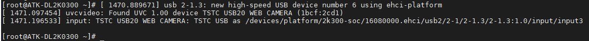
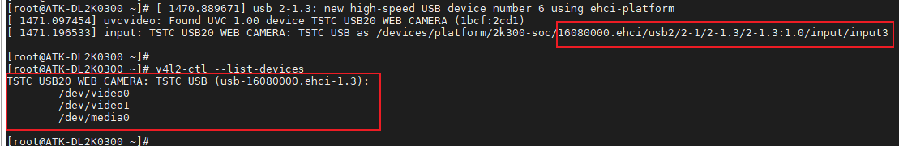
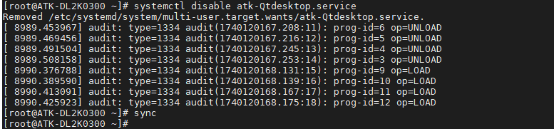
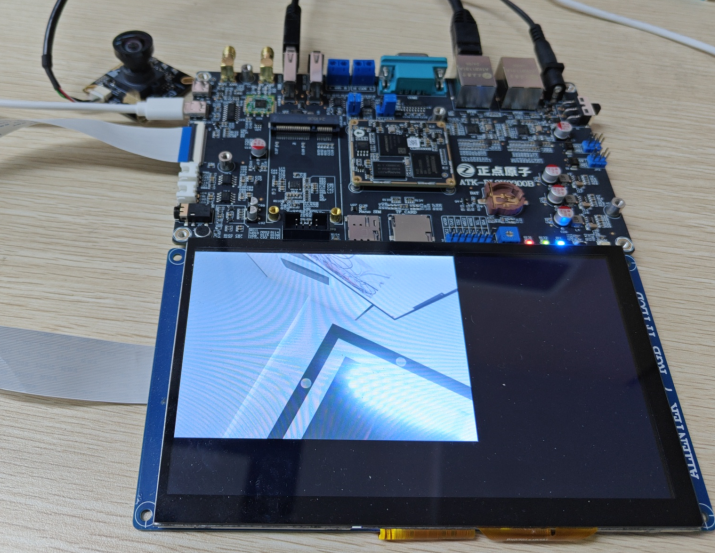
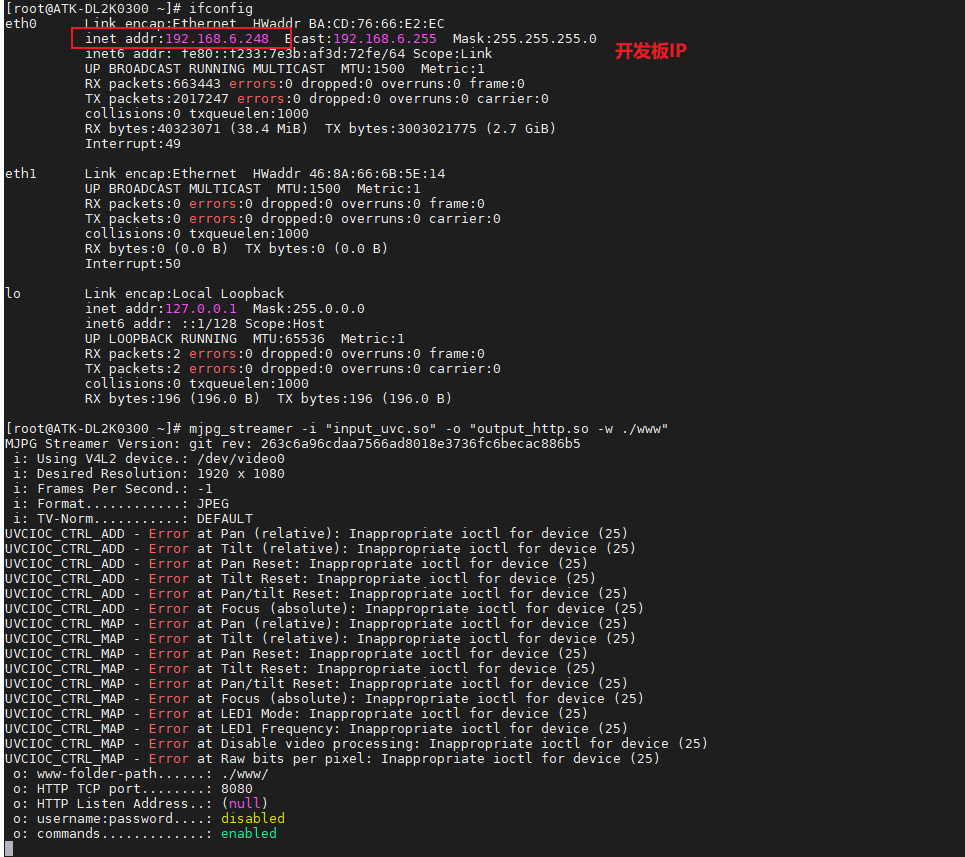
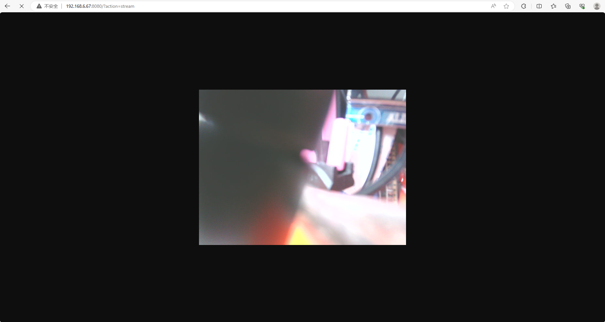

# 3.10 USB摄像头测试

&emsp;&emsp;实验前请准备 USB 摄像头，符合 UVC（USB video device class）协议的摄像头均可。UVC，全称为：USB video class 或 USB video device class，是 Microsoft 与另外几家设备厂商联合推出的为 USB 视频捕获设备定义的协议标准。符合 UVC 规格的硬件设备在不需要安装其他驱动程序下即可在主机中正常使用。

&emsp;&emsp;插上 USB 摄像头，支持热插拨，串口打印的信息如下。

<center>

</center>

&emsp;&emsp;使用 v4l2-ctl 工具检查摄像头是否已正确连接并被识别。

```c#
v4l2-ctl --list-devices
```

<center>

</center>

&emsp;&emsp;可以看得出，/dev/video0对应的就是USB摄像头的节点，接下来我们操作这个节点即可。

## 3.10.1 LCD屏显示

&emsp;&emsp;需先退出系统QT界面，输入下面命令：

```c#
systemctl disable atk-Qtdesktop.service			//退出QT服务
```

<center>

</center>

&emsp;&emsp;重启开发板即可。

&emsp;&emsp;**后面有需求想要恢复QT界面，可以输入‘systemctl enable atk-Qtdesktop.service’命令，然后重启开发板即可。**

&emsp;&emsp;使用mjpg-streamer播放usb 摄像头的视频流并在LCD屏上观看。

```c#
mjpg_streamer -i "input_uvc.so -d /dev/video0" -o "output_viewer.so"
```

&emsp;&emsp;input_uvc.so：输入的插件。

&emsp;&emsp;output_viewer.so：输出的插件。

<center>

</center>

## 3.10.2 网页显示

&emsp;&emsp;使用mjpg-streamer 播放usb 摄像头的视频流并通过浏览器查看。**注意：需要开发板的网络IP与电脑的IP处于同一局域网中才行。**笔者这里是开发板和电脑都连接同一个交换机的。

```c#
mjpg_streamer -i "input_uvc.so" -o "output_http.so -w ./www"
```
&emsp;&emsp;-i "input_uvc.so"：这部分指定了输入插件。<br />
&emsp;&emsp;-o "output_http.so -w ./www"：这部分指定了输出插件及其选项。<br />
&emsp;&emsp;w ./www 是该插件的一个选项，它指定了用于提供 HTTP 服务的网页文件的目录。

<center>

</center>

&emsp;&emsp;此时已经获取到开发板的ip为192.168.6.248(根据自己的实际IP)，在浏览器上输入指令。

```c#
http://192.168.6.248:8080/?action=stream
```

&emsp;&emsp;IP地址：192.168.6.248 是一个私有IP地址。<br />
&emsp;&emsp;端口号：8080 是一个常用的非标准HTTP端口。<br />
&emsp;&emsp;查询参数：?action=stream 是URL的查询部分，它向服务器发送了一个参数。

<center>

</center>


