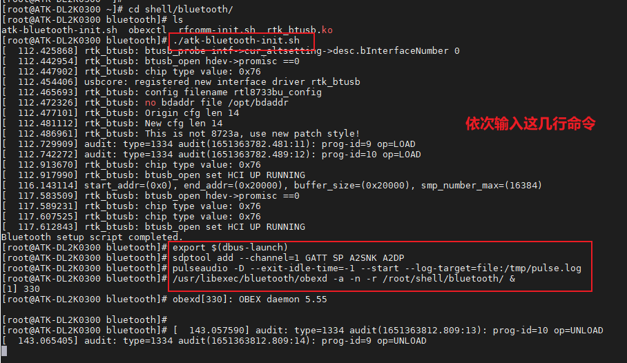
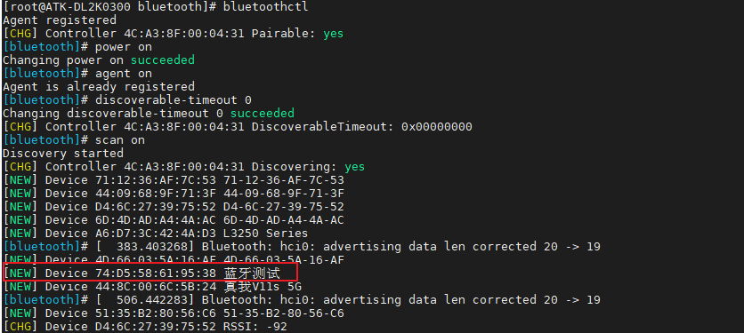
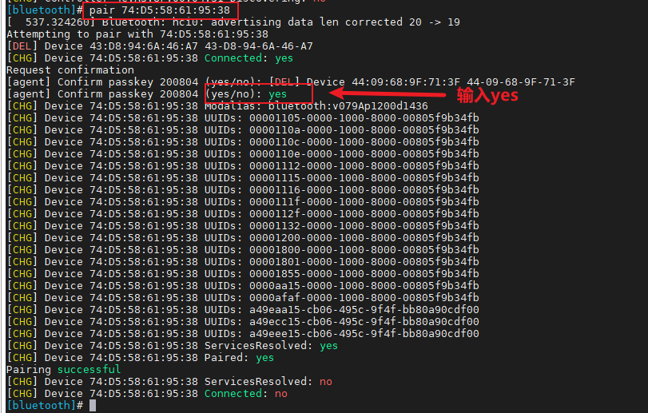
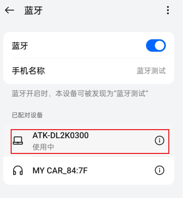
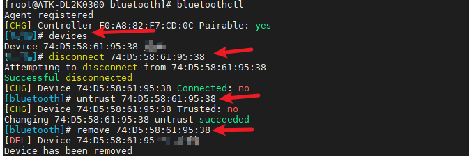
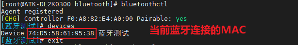
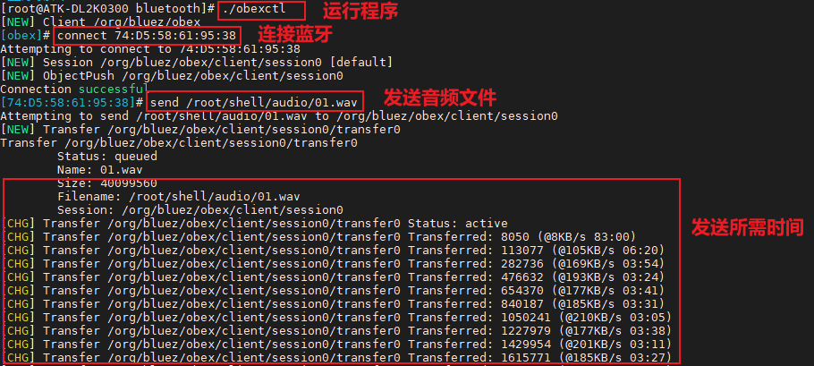
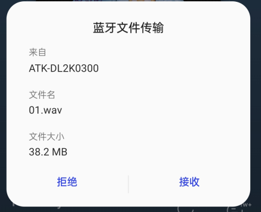
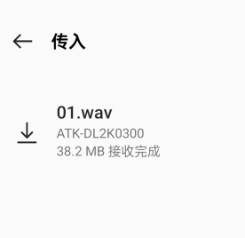

# 3.13 板载蓝牙测试

&emsp;&emsp;蓝牙开发依赖 Buildroot，蓝牙驱动模块 rtk_btusb.ko 等文件都是 Buildroot 配置选择正确的Wi-Fi/BT 模组的前提下才会生成。

&emsp;&emsp;蓝牙协议有非常多，如下。<br />
&emsp;&emsp;L2CAP: 逻辑链路控制和适配协议，用于建立和维护逻辑链路连接。<br />
&emsp;&emsp;RFCOMM: 远程串口协议，将串口设备的数据传输映射到蓝牙上。<br />
&emsp;&emsp;SDP: 服务发现协议，用于查找和描述可用的蓝牙服务。<br />
&emsp;&emsp;GAP: 通用访问协议，定义了设备之间的基本连接和通信规则。<br />
&emsp;&emsp;GATT: 通用属性协议，用于建立和管理设备之间的属性数据交换。<br />
&emsp;&emsp;ATT: 属性协议，用于在蓝牙设备之间传输属性值。<br />
&emsp;&emsp;HFP: 手机蓝牙耳机协议，用于手机和蓝牙耳机之间的音频通信。<br />
&emsp;&emsp;A2DP: 高级音频分发协议，用于在蓝牙设备之间传输高质量音频数据。<br />
&emsp;&emsp;AVRCP: 音频/视频远程控制协议，用于在蓝牙设备之间传输媒体控制命令。

&emsp;&emsp;笔者水平有限，蓝牙是一个很大的知识点，本次仅以演示蓝牙 RFCOMM 远程串口使用方法，其他协议可以自行研究。

&emsp;&emsp;**Buildroot 系统路径下就有板载的蓝牙驱动模块/lib/modules/rtk_btusb.ko。**

## 3.13.1 蓝牙音乐

&emsp;&emsp;执行蓝牙初始化脚本，切换路径在/root/shell/bluetooth/。


```c#
./atk-bluetooth-init.sh 		#加载脚本 
export $(dbus-launch)		#启动DBus会话，并导出环境变量
sdptool add --channel=1 GATT SP A2SNK A2DP		#添加SDP服务
pulseaudio -D --exit-idle-time=-1 --start --log-target=file:/tmp/pulse.log	#启动PulseAudio，配置日志输出到文件
/usr/libexec/bluetooth/obexd -a -n -r /root/shell/bluetooth/ &	#启动OBEX守护进程，后台运行，并指定根目录
```

<center>

</center>

&emsp;&emsp;蓝牙配对：<br />
&emsp;&emsp;输入下面指令，进入 bluetoothctl 交互模式。

```c#
bluetoothctl
```

&emsp;&emsp;依次执行下面指令。

```c#
power on			#打开电源
agent on				#开启代理
discoverable-timeout 0	#开启可被检测，0代表无线时长
scan on				#开启扫描设备
```

&emsp;&emsp;等到扫描到自己的蓝牙设备，输入scan off停止扫描。

```c#
scan off				#停止扫描设备
```

<center>

</center>

&emsp;&emsp;笔者扫描到安卓手机蓝牙 MAC 地址，如上图，确认后就可以进行配对了。

&emsp;&emsp;输入下面指令进行配对。

```c#
pair 	74:D5:58:61:95:38			#请填写你自己的蓝牙MAC
```

<center>

</center>

&emsp;&emsp;手机端也会弹出配对码，点击配对即可。

&emsp;&emsp;输入下面的指令信任MAC。

```c#
trust 74:D5:58:61:95:38			#请填写你自己的蓝牙MAC 
```

<center>

</center>


&emsp;&emsp;最后一步，在手机端的蓝牙设置里面，点击“ATK-DL2K0300B”设备进行连接即可。手机端播放音乐就可以在开发板上播放了。

<center>

</center>

&emsp;&emsp;如果出现蓝牙连接了无效果或者失败，可以清理一下bluetoothctl里面的蓝牙信息，重新scan on连接：

```c#
devices								#查看已匹配的蓝牙
disconnect 74:D5:58:61:95:38			#命令用于断开与特定蓝牙设备的连接
untrust 74:D5:58:61:95:38				#将一个蓝牙设备从信任列表中移除
remove 74:D5:58:61:95:38				#配对列表中移除一个蓝牙设备
```

<center>

</center>

## 蓝牙传输文件

&emsp;&emsp;蓝牙传输文件本章节基于4.13.1蓝牙音乐上，需完成上一小节。文件发送操作在板子上需要借助 obexctl 工具，这个工具已经放在/root/shell/bluetooth/目录下。

&emsp;&emsp;第一步，查看连接蓝牙的MAC。

```c#
bluetoothctl				#进入bluetoothchl模式
devices					#查看连接的蓝牙MAC
```

<center>

</center>

&emsp;&emsp;第二步，运行obexctl工具，并连接蓝牙。

```c#
./obexctl					#运行obexctl
connect	74:D5:58:61:95:38		#查看连接的蓝牙MAC
```

&emsp;&emsp;第三步，在开发板端发送文件到手机端。

```c#
send /root/shell/audio/01.wav	#发送一个音频文件到手机端
```

<center>

</center>

<center>

</center>

<center>

</center>

&emsp;&emsp;上述操作已完成了在开发板上传输文件到手机端。

&emsp;&emsp;输入exit即可退出obexctl工具，手机端传送文件开发板端就简单了，直接在手机上选择一个图片，选择蓝牙分享即可，这个自行操作，文件最终会存在放/root/shell/bluetooth/目录下。


