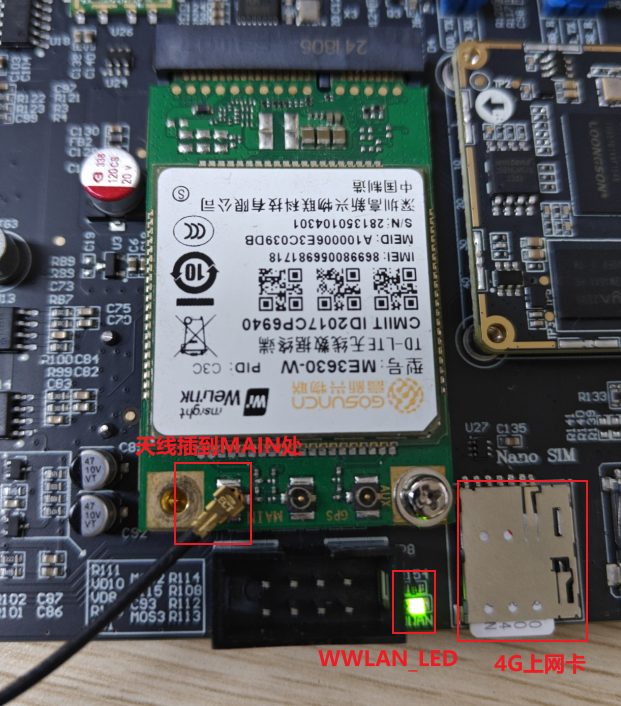
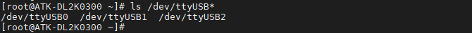
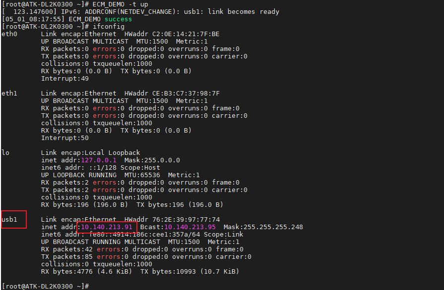
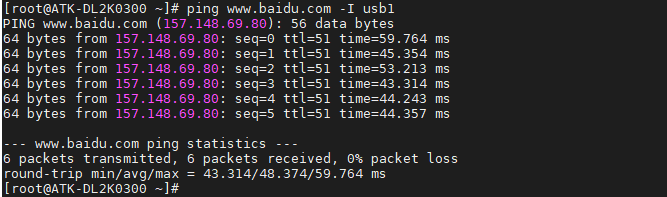
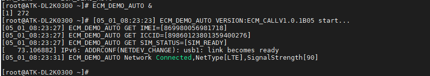

# 3.14 模块ME3630-W测试

&emsp;&emsp;ATK-DL2K0300B开发板预留一个4G模块接口，支持ME3630-W、EC20和FG132-GL等4G模块的安装。准备ME3630-W 4G模块，正点原子店铺代理出售。将ME3630-W 4G模块插到4G模块接口处，拧上螺丝。保证4G模块与座子接口吻合连接。请使用原装天线，把天线连接到4G模块的MAIN接口处。（温馨提示：4G模块在开封使用后，金手指容易氧化，时间长了上面会有一层氧化膜，如果多次实验不成功，请检查4G模块是否插好，或者是否有氧化膜。使用后请保存好4G模块！）

&emsp;&emsp;正确插入4G卡（支持移动、联通、电信4G卡）及插好模块，开发板启动后底板上的WWAN LED 会亮绿灯。如果WWAN LED绿灯未亮起，请检查模块是否正确连接插入，4G卡是否插入，天线是否接好，需插上配带的12V电源。


<center>

</center>

&emsp;&emsp;4G模块正常加载后，可以在/dev/下看到有3个ttyUSB*生成。4G模块通过AT指令访问/dev/ttyUSB2进行通信。

```c#
ls /dev/ttyUSB*
```

<center>

</center>


## 3.14.1 ECM上网

&emsp;&emsp;在操作系统看来，CDC ECM设备就是一个虚拟以太网卡，包含标准网卡需要的MAC地址和IP地址。

&emsp;&emsp;ECM_DEMO_AUTO和ECM_DEMO是高新兴ECM上网的程序（我们不需要知道源码，因为它只是一个工具），指令简介如下：

```c#
ECM_DEMO -t up                           //开启ecm上网 
ECM_DEMO -t down                         //关闭ecm上网
ECM_DEMO -t up -p /dev/ttyUSB1 -a 3gnet  //开启的同时指定对应的apn和拨号端口
ECM_DEMO -t down -p /dev/ttyUSB1         //关闭ecm上网
```

&emsp;&emsp;详细的参数可以执行ECM_DEMO -h查看。

&emsp;&emsp;ECM_DEMO_AUTO 和 ECM_DEMO参数是一样的，区别是ECM_DEMO执行完流程就会退出，ECM_DEMO_AUTO会一直运行并每隔一段时间会检查是否断网，断网了会自动重连。

&emsp;&emsp;ECM_DEMO_AUTO默认会自动执行拨号流程，故适合做开机自启的程序。

&emsp;&emsp;要配置ECM模式上网，执行下面的指令配置成ECM模式连接网络。使用ifconfig指令查看usb0获取的ip地址，如果没有获取到ip地址，请使用udhcpc -i usb1获取。

```c#
ECM_DEMO -t up
ifconfig
```

<center>

</center>

&emsp;&emsp;ping百度测试连通性，-I是指定网卡，有数据回复表示连通。按Ctrl+c终止指令。

```c#
ping www.baidu.com -I usb1		// -I参数是指定网卡名usb1（4G网络）
```

<center>

</center>

&emsp;&emsp;如果需要检测4G是否在线（断线重连），建议使用./ECM_DEMO_AUTO &指令，放于后台运行。连上后如果没有获取到ip地址，请使用`udhcpc -i usb1`获取。

<center>

</center>

