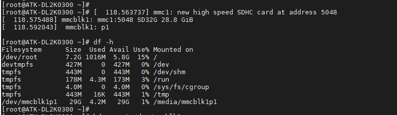
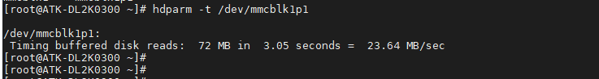
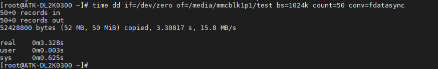
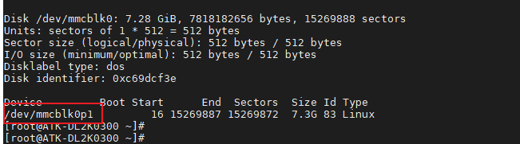
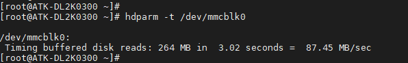
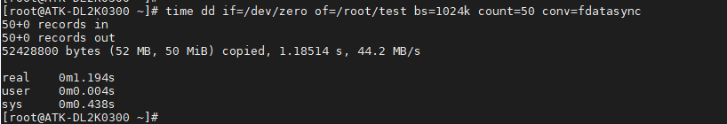

# 3.17 TF（SD）卡&EMMC测试

指令提示：<br />
&emsp;&emsp;time命令常用于测量一个命令的运行时间，dd 用于复制，从 if(input file)文件读出，写到 of(output file)指定的文件，bs 是每次写块的大小，count 是读写块的数量。"if=/dev/zero"不产生 IO，即可以不断输出数据，因此可以用来测试纯写速度。

## 3.17.1 SD卡测试

&emsp;&emsp;开发板启动后将 TF 卡插到开发板底板卡槽处，打印信息如下。开发板会将 TF 卡自动挂载。（注意需要使用 FAT32 格式的 TF 卡）。

&emsp;&emsp;使用 df -h 命令，查看 SD 挂载的分区。运行结果如下所示：

<center>

</center>

&emsp;&emsp;读取速度测试，常用于测试硬盘读取速度指令有 hdparm 与 dd，本次只演示 hdparm 读取TF 卡的速度，数据采样时间过短，数据量少，速度仅供参考。

```c#
hdparm -t /dev/mmcblk1p1
```

<center>

</center>

&emsp;&emsp;可以看出读取速度为23.64MB/sec。
	
&emsp;&emsp;写速度测试：

```c#
time dd if=/dev/zero of=/media/mmcblk1p1/test bs=1024k count=50 conv=fdatasync
```

<center>

</center>


&emsp;&emsp;可以看出写速度为15.8MB/s。

## 3.17.2 EMMC测试

&emsp;&emsp;eMMC 作为存储设备，里面存放了 linux 系统，日后用户开发的应用都是在存储在这个设备里面（如果你不外接存储设备的话）。使用 fdisk -l 命令确定，EMMC 挂载的分区。

```c#
fdisk -l
```

<center>

</center>

&emsp;&emsp;读取速度测试

```c#
hdparm -t /dev/mmcblk0
```

<center>

</center>

&emsp;&emsp;可以看出读取速度为87.45MB/sec。

&emsp;&emsp;写速度测试

```c#
time dd if=/dev/zero of=/root/test bs=1024k count=50 conv=fdatasync
```

<center>

</center>

&emsp;&emsp;可以看出写速度为44.2MB/s。


