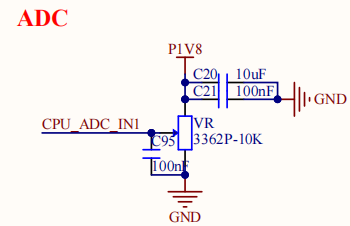
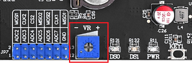

# 3.18 ADC测试

&emsp;&emsp;注意：ADC的采集电压绝对值最大是1.8V，请不要超过 1.8V，否则可能对芯片造成损坏。ATK-DL2K0300B底板上VR处留有一路ADC方便用户测试。底板原理图如下。

<center>

</center>

&emsp;&emsp;下图为ATK-DL2K0300B开发板的ADC位置。

<center>

</center>

ADC的主要特性：<br />
&emsp;&emsp;龙芯2K0300B支持ADC功能，集成一路12bit 8通道的ADC。

&emsp;&emsp;在Linux系统中，ADC采样属于IIO子系统下，可以通过sysfs提供的接口来访问ADC控制器，使用的是12位精度。

&emsp;&emsp;标准的 IIO 设备文件目录，我们只关心两个文件：

&emsp;&emsp;in_voltage1_raw：ADC1 原始值文件。<br />
&emsp;&emsp;in_voltage_scale：ADC 比例文件（分辨率），单位为 mV。

&emsp;&emsp;实际电压值（mV）= in_voltage1_raw * in_voltage_scale。

&emsp;&emsp;我们的开发板此时的 in_voltage1_raw 和 in_voltage_scale 这两个文件内容如下：

```c#
cat /sys/bus/iio/devices/iio\:device0/in_voltage1_raw
cat /sys/bus/iio/devices/iio\:device0/in_voltage_scale
```

<center>

</center>

&emsp;&emsp;经过计算，图中实际电压：0.439453125 * 2074 = 911.42578125，也就是 0.91V 左右。可以拿万能板实测一下，计算出来的电压值约等于实测出来的电压值。


