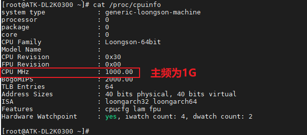

# 3.20 查看CPU相关信息

&emsp;&emsp;正点原子ATK-DL2K0300B开发板处理器最高支持1GHz主频。出厂系统也是默认使用1G主频来工作。

&emsp;&emsp;输入下面指令，查看当前CPU信息。

```c#
cat /proc/cpuinfo
```

<center>

</center>

&emsp;&emsp;Loongson-64bit，这表明CPU属于龙芯64位系列。CPU MHz：1000.00，表示CPU的主频为1000MHz，即1GHz。