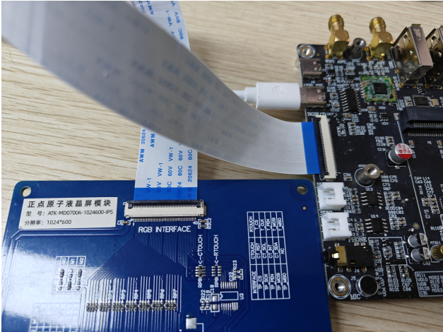
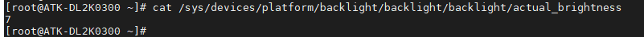
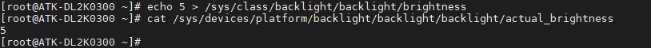

# 3.3 LCD测试

&emsp;&emsp;此节仅适用于选配了屏幕的开发板用户。目前适配的RGB屏幕为4.3寸屏（800x480）和7寸屏（1024x600）。接线如下图所示：

<center>

</center>

## 3.3.1 触摸测试

&emsp;&emsp;与3.2小节方法一样，开发板启动后我们输入cat /proc/bus/input/devices指令查看触摸屏对应的触摸事件，也可直接在屏幕上进行触摸点击、滑动，测试屏幕是否正常触摸。

## 3.3.2 背光测试

&emsp;&emsp;LCD 屏幕的背光支持 8 级变化，亮度级数为 0～7，默认为 7。查看LCD屏幕最大亮度等级.

```c#
cat /sys/devices/platform/backlight/backlight/backlight/max_brightness
```

<center>

</center>

&emsp;&emsp;查看当前 LCD 屏幕背光亮度等级

```c#
cat /sys/devices/platform/backlight/backlight/backlight/actual_brightness
```

<center>

</center>

&emsp;&emsp;修改当前 LCD 屏幕背光亮度等级，修改后再查看当前亮度等级

```c#
echo 5 > /sys/class/backlight/backlight/brightness 	// 修改亮度等级为 5
cat /sys/devices/platform/backlight/backlight/backlight/actual_brightness
```

<center>

</center>


