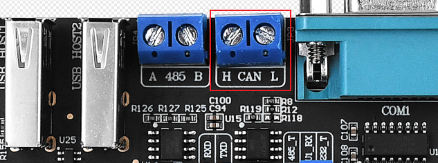
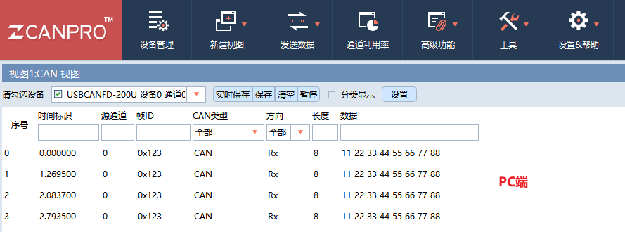
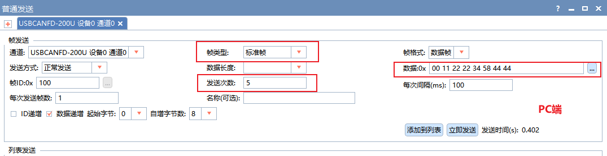
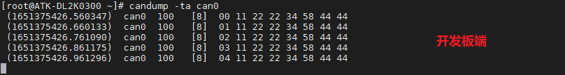
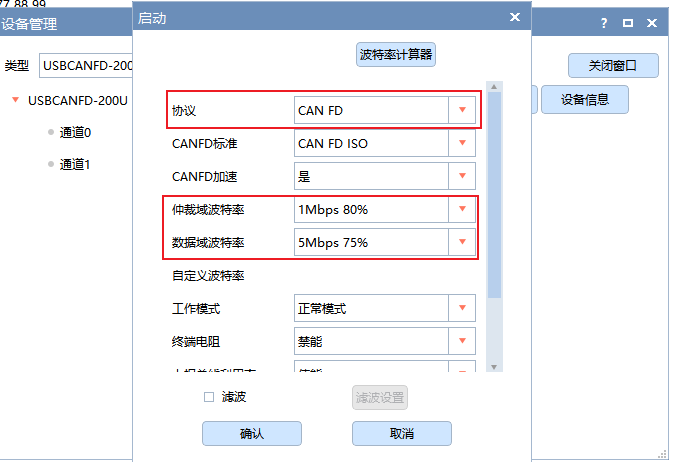
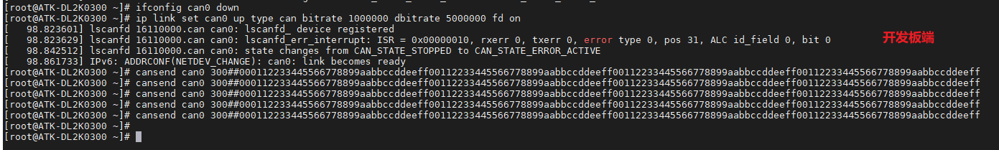
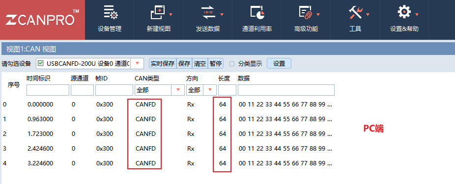
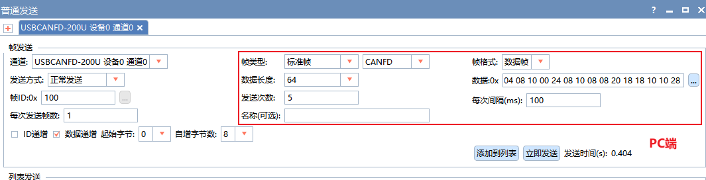
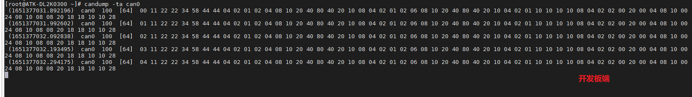

# 3.7 CAN测试

&emsp;&emsp;ATK-DL2K0300B开发板板载1路CAN（均支持CAN FD）。在测试CAN之前，需要准备好测试CAN的仪器，比如周立功的CAN分析仪、创芯科技的CAN分析仪和广成科技的CAN分析仪等，否则只能用两块不同开发板的CAN或者其他CAN设备测试。关于CAN仪器及CAN上位机的使用，请参照各厂商产品的使用说明书。

&emsp;&emsp;开发板所使用的CAN的主要特性如下：
- 支持CAN FD，可以理解成CAN协议的升级版，只升级了协议，物理层未改变。<br />
- CAN与CAN FD主要区别：传输速率不同、数据长度不同、帧格式不同、ID长度不同。<br />
- 数据比特率最高5Mbps。

&emsp;&emsp;测试前请将CAN分析仪或者测试CAN的设备连接到ATK-DL2K0300B开发板的CAN接口，CANH端连接CAN仪器的CANH，CANL端连接CAN仪器的CANL。

&emsp;&emsp;下面举例使用FDCAN1接口来进行CAN功能测试。开发板CAN接口如下图所示。


<center>

</center>

## 3.7.1 CAN测试

&emsp;&emsp;CAN最低数据比特率10kBit/s，最高数据比特率1000kBit/s。

&emsp;&emsp;测试前提示一下，下面示例指令，是基于CAN接口测试，对应系统设备名称为can0。

&emsp;&emsp;示例CAN接口，配置can0数据比特率为500kBit/s。

```c#
ip link set can0 up type can bitrate 500000
```

&emsp;&emsp;使用cansend指令发送数据。

```c#
cansend can0 123#1122334455667788
```

解释：<br />
（1）can0：can0表示FDCAN1接口设备。<br />
（2）123：帧ID<br />
（3）1122334455667788：帧数据<br />

&emsp;&emsp;下面使用ZLG的USBCANFD200U CAN分析仪，设置CAN的速率为500000，测试结果如下图。

<center>
<br />
图3.7.1.1 开发板端发送数据
</center>

<center>
<br />
图3.7.1.2 PC端CAN上位机接收数据
</center>

&emsp;&emsp;使用candump指令接收数据。按Ctrl+c终止指令。

```c#
candump -ta can0
```

解释：
&emsp;&emsp;（1）-ta: t代表打印时间，a代表开启ASCII输出。

<center>
<br />
图3.7.1.3 PC端CAN上位机发送数据
</center>

<center>
<br />
图3.7.1.4 开发板端接收数据
</center>

## 3.7.2 CAN FD测试

&emsp;&emsp;下面进行CAN FD测试。如果CAN测试设备不支持CAN FD功能，则不能用于测试CAN FD。

&emsp;&emsp;开发板的CAN FD波特率最高为1000 kBit/s，数据波特率为5000 kBit/s。可用的速率如下，如需要使用更低的波特率，请使用CAN，而非CAN FD。

&emsp;&emsp;测试前提示一下，下面示例指令，是基于FDCAN1接口测试，对应系统设备名称为can0。若用户需要测试其他CAN接口，则对应系统设备名称为canX，注意修改指令即可。

&emsp;&emsp;设置不同速率时，需要先关闭CAN设备，再设置CAN的速率，如果设置不成功，请重启板子或者上位机软件。

```c#
ifconfig can0 down
```

&emsp;&emsp;这里提供配置CAN FD的速率示例，只需要选择下面其中一条指令来配置即可。

```c#
ip link set can0 up type can bitrate 1000000 dbitrate 5000000 fd on
ip link set can0 up type can bitrate 500000 dbitrate 1000000 fd on
ip link set can0 up type can bitrate 100000 dbitrate 5000000 fd on
```

&emsp;&emsp;此处设置仲裁波特率为1M bps，数据波特率为5M bps进行测试。

```c#
ip link set can0 up type can bitrate 1000000 dbitrate 5000000 fd on
```

<center>
<br />
图3.7.2.1 ZLG CAN FD测试仪器上位机配置
</center>

&emsp;&emsp;使用cansend命令发送长度64位数据，下面为一行指令，请把命令复制到记事本上整合成一行命令，在拷贝在开发板上运行！

```c#
cansend can0 300B##000112233445566778899aabbccddeeff00112233445566778899aabbccddeeff00112233445566778899aabbccddeeff00112233445566778899aabbccddeeff
```

解释：
&emsp;&emsp;（1）can0: can0表示FDCAN1接口设备。<br />
&emsp;&emsp;（2）123: 帧ID<br />
&emsp;&emsp;（3）0：标志（flags）<br />
&emsp;&emsp;（4）001122…: 帧数据

<center>
<br />
图3.7.2.2 开发板发送CANFD数据
</center>

<center>
<br />
图3.7.2.3 PC端CAN上位机接收数据
</center>

&emsp;&emsp;使用candump指令接收数据。按Ctrl+c终止指令。


```c#
candump -ta can0
```

解释：
&emsp;&emsp;（1）-ta: t代表打印时间，a代表开启ASCII输出

<center>
<br />
图3.7.2.4 PC端CAN上位机发送数据
</center>

<center>
<br />
图3.7.2.5 开发板端接收数据
</center>


