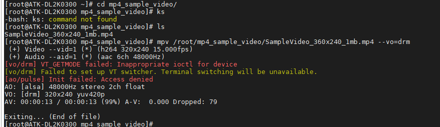

# 3.11 MPV播放视频

&emsp;&emsp;这是一个测试视频，用于测试MPV是否能使用。

```c#
mpv /root/mp4_sample_video/SampleVideo_360x240_1mb.mp4 --vo=drm
```

&emsp;&emsp;mpv：这是命令行媒体播放器的名称。<br />
&emsp;&emsp;/root/mp4_sample_video/SampleVideo_360x240_1mb.mp4：这是要播放的视频文件的路径。<br />
&emsp;&emsp;--vo=drm：这是一个选项，用于指定视频输出（Video Output）模块。


<center>

</center>

