# 3.12 板载USB WIFI测试

&emsp;&emsp;ATK-DL2K0300B 板载了一个 RTL8733BU 芯片，此芯片是 WIFI 和蓝牙二合一。**开机使用/etc/init.d/S36wifibt-init.sh**初始化 WIFI 驱动和蓝牙驱动。如若你接了 RGB屏幕，可以点击WIFI功能APP无线局域网测试即可。

<center>
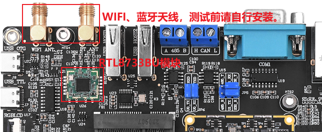
</center>

## 3.12.1 station模式

&emsp;&emsp;WiFi 的 Station 模式是一种工作模式，它使 WiFi 设备能够连接到一个 WiFi 网络并与其他
设备进行通信。在 Station 模式下，WiFi 设备可以作为一个客户端连接到一个已有的 WiFi 网络，这个网络可以是家庭、办公室或公共场所提供的无线网络。在连接上 WiFi 网络后，设备就可以通过这个网络与其他设备进行数据传输和通信。通常，Station 模式适用于需要将设备连接到已有的 WiFi 网络中的场景，例如手机、电脑、智能家居设备等。

&emsp;&emsp;注意，默认 wlan0 是没有打开的。

```c#
ifconfig wlan0 up 	#打开wlan0
ifconfig		#查看wlan0是否开启。
```

<center>
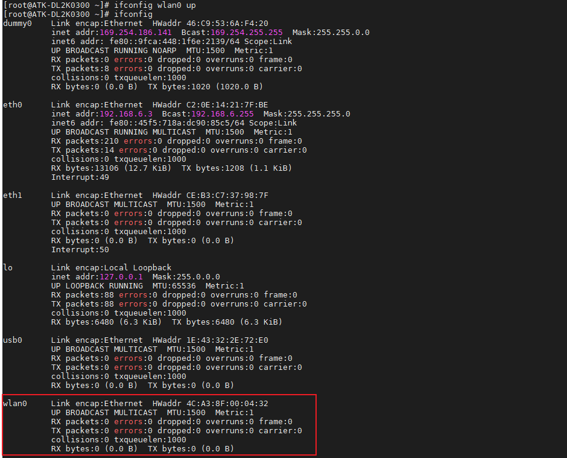
</center>

&emsp;&emsp;我们可以使用下面指令来连接WIFI。

```c#
connmanctl				#进入WIFI操作终端
connmanctl> enable wifi		#使能WIFI，默认已经使能
connmanctl> agent on		#开启代理
connmanctl> scan wifi		#开启WIFI扫描，可以多次扫描
connmanctl> services		#列出扫描到的WIFI列表
```

&emsp;&emsp;命令运行结果如下所示：

<center>
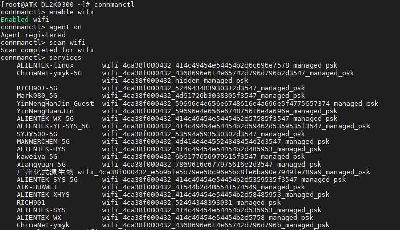
</center>

&emsp;&emsp;我们可以使用下面指令来连接WIFI。

```c#
connmanctl				#进入WIFI操作终端
connmanctl> enable wifi		#使能WIFI，默认已经使能
connmanctl> agent on		#开启代理
connmanctl> scan wifi		#开启WIFI扫描，可以多次扫描
connmanctl> services		#列出扫描到的WIFI列表
```

&emsp;&emsp;命令运行结果如下所示：

<center>

</center>

&emsp;&emsp;从扫描到 WIFI 列表中，使用 connect XXXX 进行连接，再输入密码按回车确认。比如笔者要连接“ALIENTEK-linux”，（**若使用 IOS 手机热点，开启 IOS 热点时可能需要选择兼容性，同时也要注意，如果 WIFI 信号很差（离太远），或者输入密码都有可能连接不上 WIFI，测试时请确认这两个因素**）运行结果如下命令:

```c#
connect wifi_4ca38f000432_414c49454e54454b2d6c696e7578_managed_psk		#连接
exit		#退出终端
```

<center>
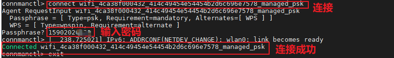
</center>

&emsp;&emsp;连接成功后，可以使用ifconfig指令来查看wlan0所获取的IP地址。

<center>
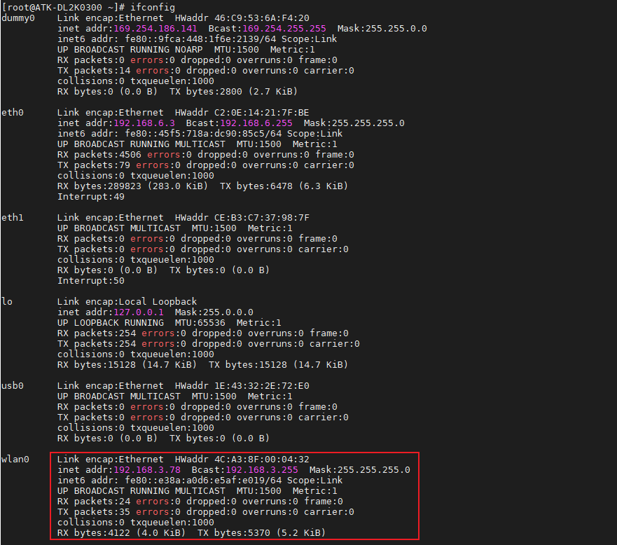
</center>

&emsp;&emsp;ping百度测试连通性，也可以ping网关来测试WIFI的连通性。

```c#
ifconfig eth0 down		#wlan0与eth0的网关不一样，要关掉
ping www.baidu.com -I wlan0  #ping百度测试
ping 192.168.3.1 -I wlan0	#ping网关，请改为自己的网关，192.168.x.x
```

<center>
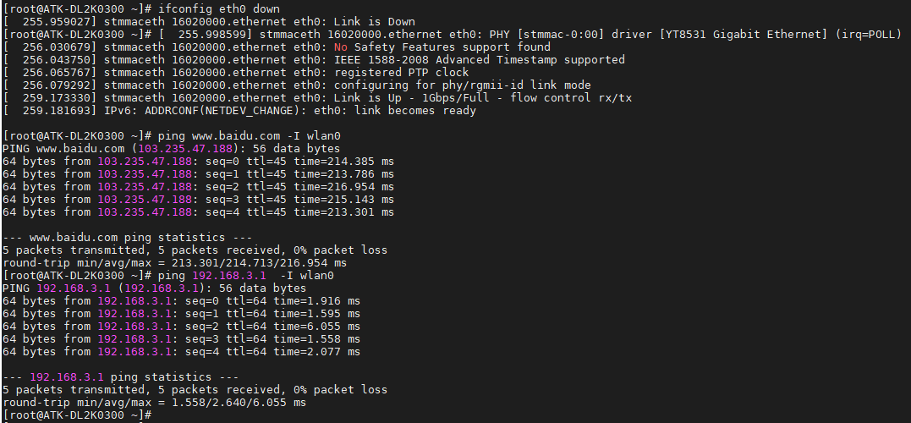
</center>

## 3.12.2 softap模式

&emsp;&emsp;WiFi 的 SoftAP 模式是一种工作模式，它允许 WiFi 设备像一个无线路由器一样工作。在SoftAP 模式下，WiFi 设备可以作为一个热点，允许其他设备连接并使用它提供的网络服务。通常，SoftAP 模式适用于需要将设备转化为一个无线热点的场景，例如智能家居设备、无线打印机、游戏机等。在 SoftAP 模式下，设备可以设置 SSID、密码等参数，允许其他设备连接并通过它提供的网络服务进行数据传输和通信。由于 SoftAP 模式可以使设备像一个无线路由器一样工作，因此它通常被用于一些特殊的场景，例如网络调试、数据采集等。

&emsp;&emsp;正点原子编写的开启热点的脚本都放在了/root/shell/wifi 目录下，如下图。

<center>
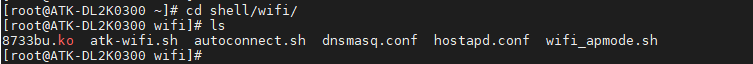
</center>

&emsp;&emsp;dnsmasq.conf文件内容如下：

<center>
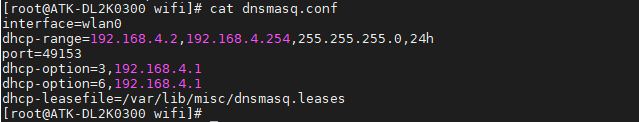
</center>

&emsp;&emsp;hostapd.conf文件内容如下：

<center>
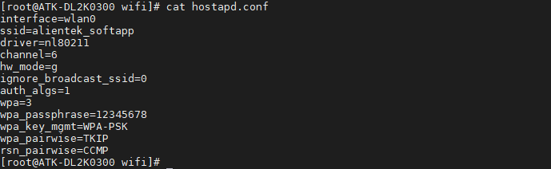
</center>

&emsp;&emsp;awifi_apmode.sh文件内容如下：

<center>
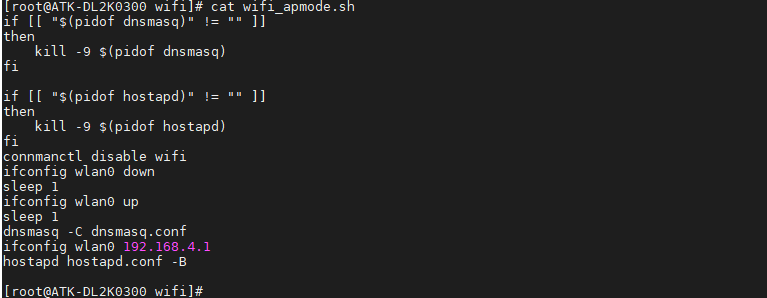
</center>

&emsp;&emsp;执行下面指令，开启热点。成功开启热点如下图。

```c#
./wifi_apmode.sh		#开启热点脚本
```

<center>
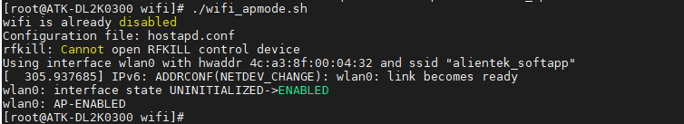
</center>

&emsp;&emsp;执行下面指令，看softap模式是否启动了。

```c#
iw dev		#查看ssid，如果是hostapd.conf文件设置的alientek_softapp则成功
```

<center>
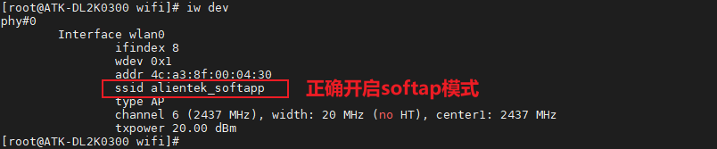
</center>

&emsp;&emsp;用手机连接测试热点名称“alientek”即可，密码是 hostapd.conf 文件里配置的“12345678”。笔者用手机连接上了板子发出的热点。可以看到，板子的 ip 是是我们 atk-wifi-apmode.sh 设置的 wlan0 ip 192.168.4.，充当了网关即路由器。并且手机也从开发板分配得到了一个 ip 为 192.168.4.4。注意这个热点能连接，但是不是给你上网用的，本次演示仅限局域网内连接，可以编写网络通信程序进行信息收发，热点的用途很大，比如你想附近一个设备与你的板子通信都是可以通过此热点进行信息交互，详细请看Qt 或者 C 应用教程的网络编程部分。

<center>
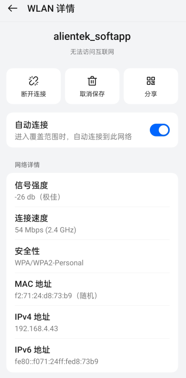
</center>

&emsp;&emsp;开启了 AP 模式，我们如何关闭 AP 模式呢？在前面的脚本中我们使用了 hostapd和 dnsmasq开启了 AP 模式，并作为后台进程，所以我们需要关闭这两个进程。就可以关闭 AP 模式。执行下面的指令关闭进程。

```c#
killall hostapd dnsmasq 		//列出扫描到的 WIFI 列表
```

<center>

</center>

&emsp;&emsp;此时我们使用 iw dev 指令查看无线网络接口。看到无线网络的类型为 managed 即为客户端模式，也是我们上面说的 station 模式。

<center>
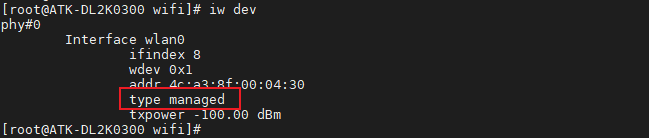
</center>


