# 3.4 串口测试

## 3.4.1 RS232串口测试

&emsp;&emsp;ATK-DL2K0300B开发板板载一路RS232和RS485，由于它们共用同一个UART1串口，故需要调整开发板的跳线帽，来确保选择RS232功能。另外测试前需要准备一根USB转RS232公头串口线，不同品牌均可。

<center>
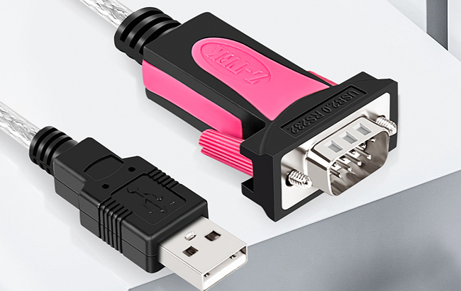
</center>

&emsp;&emsp;将USB转RS232串口线接入到RS232接口，再把JP5排针组的U1_TX和232_R，U1_RX和232_T通过跳线帽连接在一起，即将UART1串口连通RS232功能。

<center>
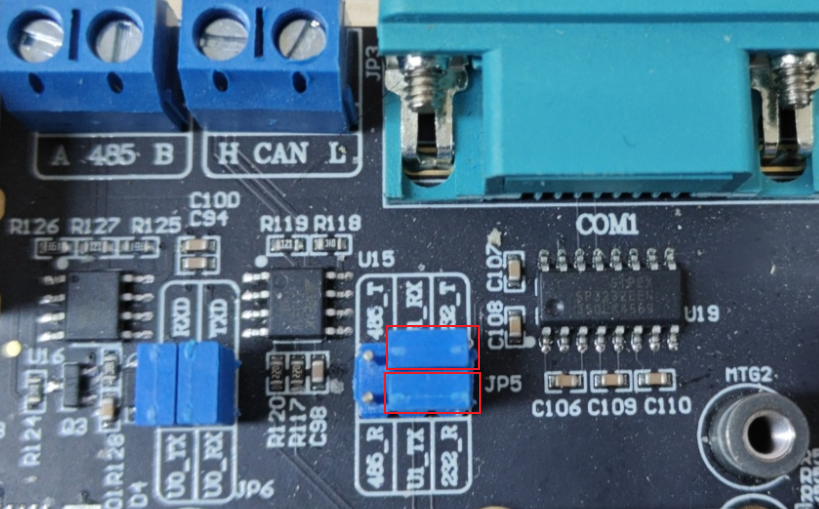<br />
图3.4.1.2 RS232跳线帽连接示意图
</center>

&emsp;&emsp;在计算机的设备管理器查看端口号。编者的端口号有两个，一个是开发板 USB 调试串口的，另一个就是RS232的端口号了。

<center>
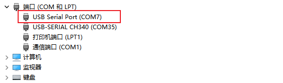
</center>

&emsp;&emsp;可以看到COM35为编者的调试串口（USB_TTL），COM7为开发板底板的 RS232(USART2)串口。下面使用MobaXterm来进行串口调试，测试数据收发测试。

&emsp;&emsp;像打开调试串口一样，再打开一个串口终端，如下图操作所示：

<center>
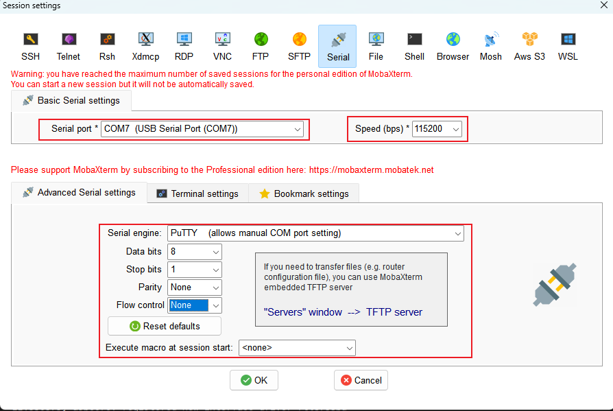
</center>

&emsp;&emsp;在开发板上执行下面命令设置UART1的配置，例如，要将串口配置为115200波特率、8数据位、1停止位和无奇偶校验，可以使用以下命令：

```c#
stty -F /dev/ttyS1 115200 cs8 -cstopb -parenb
```

<center>
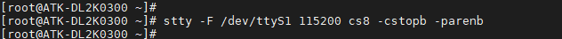
</center>

&emsp;&emsp;其中，/dev/ttyS1是UART1设备的名称。

&emsp;&emsp;接下来，进行简单的测试，可以使用cat命令来读取串口数据，并使用echo命令来发送数据。

```c#
echo "hello word" > /dev/ttyS1
```

&emsp;&emsp;开发板端发送数据：

<center>
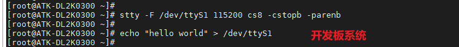
</center>

&emsp;&emsp;串口端接收数据:

<center>
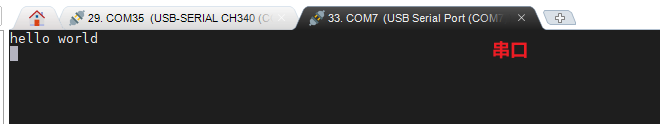
</center>

&emsp;&emsp;上面的操作我们已经实现了从开发板通过RS232串口向电脑发送数据的功能。现在，我们的目标是反过来，即从电脑端通过串口发送数据到开发板，并确保开发板能够正确地接收这些数据。

&emsp;&emsp;开发板系统输入指令“cat /dev/ttyS1”来读取串口数据，需要按Ctrl+C来停止。

<center>
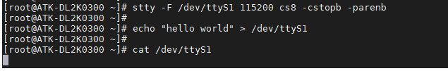
</center>

&emsp;&emsp;串口端发送数据：

<center>
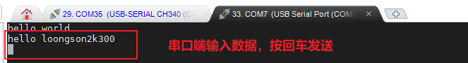
</center>

&emsp;&emsp;开发板端接收数据：

<center>
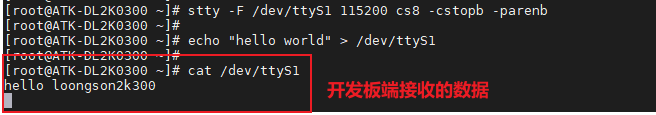
</center>

&emsp;&emsp;上述的操作，我们已经完成了对RS232的发送和接收数据的验证。

## 3.4.2 RS485串口测试

&emsp;&emsp;在3.4.1小节我们知道，RS232与RS485可以通过跳线帽进行切换。在测试RS485前，我们先切换跳线帽连接RS485到UART1。另外我们需要借助正点原子USB转换器模块来完成测试，如果用户有其他RS485相关测试工具可以自行测试，不一定要用这个模块。如下图。

<center>

</center>

&emsp;&emsp;下面将开发板JP5排针组的U1_TX和485_R，U2_RX和485_T分别通过跳线帽连接到一起，即将UART1连通RS485功能。

<center>
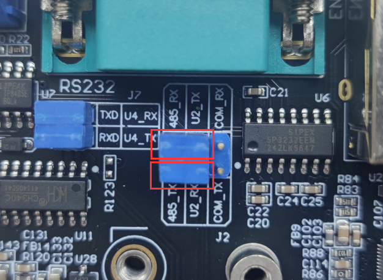
</center>

&emsp;&emsp;同时，将开发板的RS485 A端通过杜邦线连接到正点原子USB转换器模块的RS485 A端，B端连接到B端。使用了正点原子的USB转换器模块，会在PC(电脑端)看到一个串口。测试方法按3.4.1 RS232串口测试步骤来测试即可。


