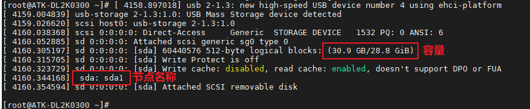
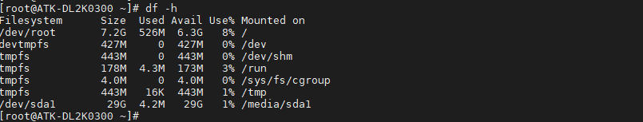
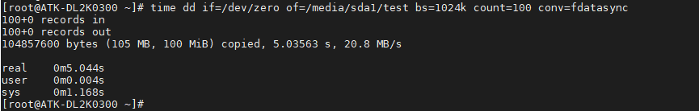
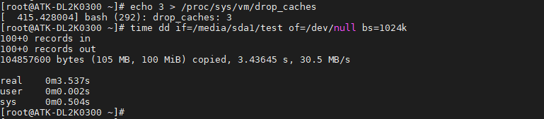
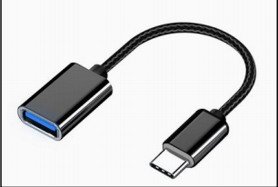

# 3.5 USB测试

## 3.5.1 USB HOST测试

&emsp;&emsp;将一个FAT32格式的U盘或者带TF卡的读卡器，直接插入到ATK-DL2K0300B开发板的USB_HOST1或USB_ HOST 2的USB接口上，出厂系统会弹出下面识别信息。

<center>

</center>

&emsp;&emsp;输入 df -h 命令，查看 U 盘当前挂载路径。

```c#
df -h
```

<center>

</center>

&emsp;&emsp;上图可看出，当前U盘挂载路径为/media/sda1，下面进行U盘读写速度测试。

&emsp;&emsp;提示，读卡器本身的接口读写速度及TF卡种类、U盘种类等也会影响速度值快慢，用户测试值可能与编者测试值不同，速度值仅供参考。

&emsp;&emsp;**写速度测试：**
	
&emsp;&emsp;输入下面命令，向U盘写入测试文件：

```c#
time dd if=/dev/zero of=/media/sda1/test bs=1024k count=100 conv=fdatasync
```

<center>

</center>

&emsp;&emsp;上面表示写入一个100MiB的test文件，写入速度为20.8MB/s。实际上写入的文件越大，求平均写入速度越接近实际值。拔出U盘之前执行一遍sync命令，同步到存储磁盘。

&emsp;&emsp;**读速度测试：**

&emsp;&emsp;输入下面指令,清理运行缓存。

```c#
echo 3 > /proc/sys/vm/drop_caches
```

&emsp;&emsp;小提示：因为 LINUX 的内核机制，一般情况下不需要特意去释放已使用的 cache。这些 cache 内容可以增加文件的读写速度。这里为了测试读写速度，故需执行释放。

&emsp;&emsp;输入下面指令,读取前面用dd指令写入的test文件。

```c#
time dd if=/media/sda1/test of=/dev/null bs=1024k
```

<center>

</center>

&emsp;&emsp;这里表示读取100MiB数据，读取速度为30.5MB/s。读卡器的读写速度等也会影响此速度值，仅供参考。

## 3.5.2 USB OTG主机测试

&emsp;&emsp;使用 USB 转 Tpye-C 连接线（若用户手上没有此连接线可不做此实验）接上 U 盘，插到USB OTG 接口处，和 3.5.1 小节一样测试即可。

&emsp;&emsp;USB 转 Tpye-C 连接线如下，此连接线请自行按需购买。

<center>

</center>

