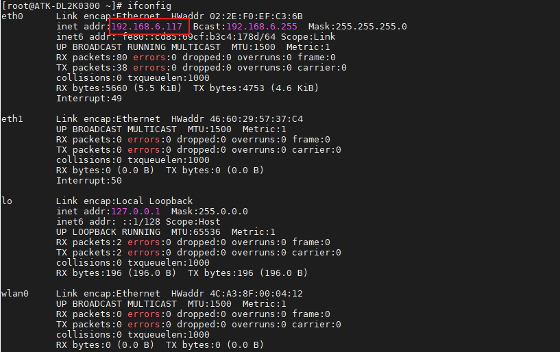
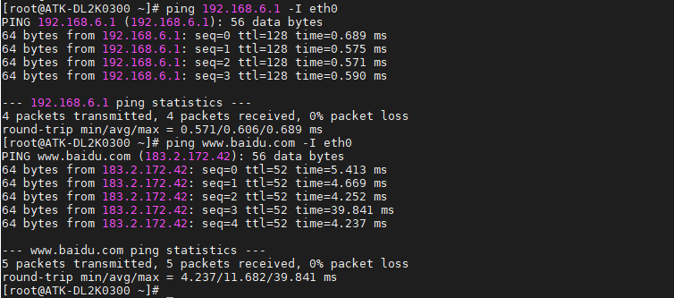
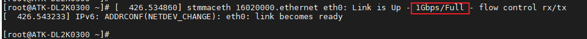
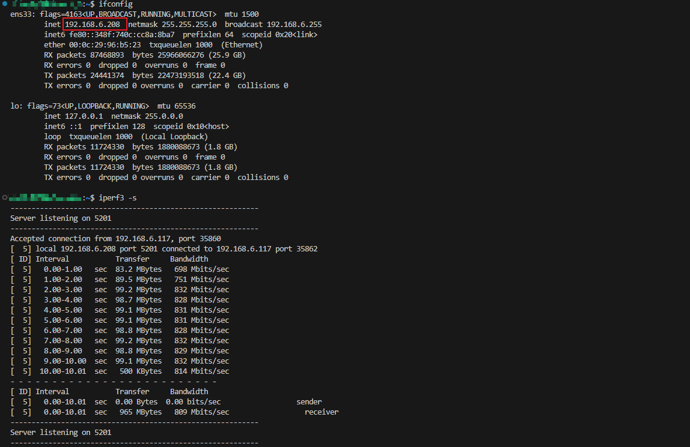
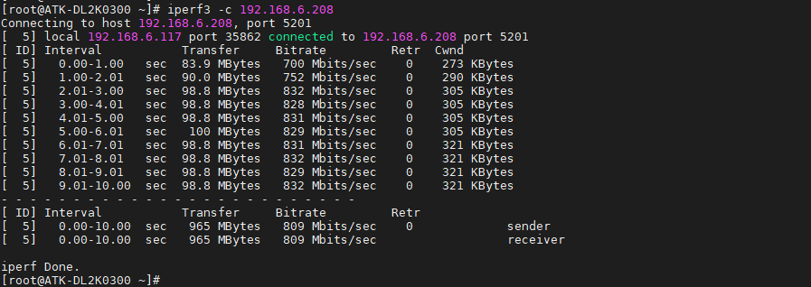

# 3.6 网络测试

&emsp;&emsp;ATK-DL2K0300B开发板板载2路千兆以太网，自适应10/100/1000M速率。

&emsp;&emsp;首先将网线插入到任一网口处，确保网线能上网，开发板出厂系统将根据本地网络环境自动获取到上网IP地址（出厂系统支持DHCP），输入ifconfig命令查看获取到的网络IP。

&emsp;&emsp;下面举例接入网口ETH1，对应网络节点eth0。而网口ETH2，对应网络节点eth1，测试方法同理。

```c#
ifconfig
```

<center>

</center>

&emsp;&emsp;检查网络能否上网，如果有数据回复，则说明网络功能正常。按Ctrl+c终止指令。

&emsp;&emsp;注意：如果出现bad address 'www.baidu.com'，请等候一会重试，网络服务切换需要时间。

```c#
ping 192.168.6.1 -I eth0
ping www.baidu.com -I eth0
```

<center>

</center>

&emsp;&emsp;如果本地网络非上网环境（局域网），则通过配置静态IP方式来测试网络通信。例如开发板配置网口ETH1网络静态IP：ifconfig eth0 192.168.1.100。PC（电脑端）配置静态IP：192.168.1.200。两者进行局域网ping通信测试。注意PC（电脑端）需关闭防火墙即可。

&emsp;&emsp;测试是否为千兆网络，注意要使用千兆网线、千兆路由器或者千兆交换机，PC（电脑端）网卡必须是千兆网卡，否则测试出来的速度或识别出来的速度可能是百兆。

&emsp;&emsp;如下图，当接口网口的时候，系统会识别为1Gbps/Full则代表是千兆网络。

<center>

</center>

&emsp;&emsp;可使用iperf3指令测试千兆网络的连接速度，测试前请确保开发板网络能够正常ping通ubuntu。

&emsp;&emsp;在ubuntu系统环境下执行如下指令，设置ubuntu为服务器；

```c#
iperf3 -s
```

&emsp;&emsp;在ATK-DL2K0300B开发板命令行，通过iperf3指令，输入服务器IP即可。

&emsp;&emsp;注意，服务器IP需根据用户ubuntu的实际IP来设置，并非统一IP；

```c#
iperf3 -c 192.168.6.208
```

解释：
&emsp;&emsp;（1）-c：客户端。<br />
&emsp;&emsp;（2）192.168.6.208：用户ubuntu的ip地址，此处仅为示例。

<center>

</center>

<center>

</center>

&emsp;&emsp;测试出来的 Bitrate 大概为 800 Mbits/sec 左右才是千兆网络速度(关闭出厂系统的QT程序会提高测试速度，开发板运行的应用会影响测试速度)。


