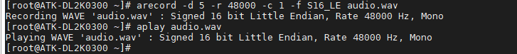
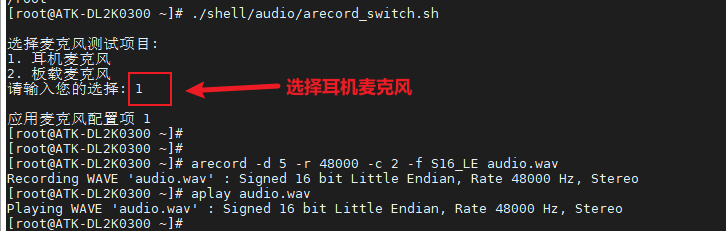

# 3.9 音频测试

&emsp;&emsp;ATK-DL2K0300B开发板板载一颗高性能音频编解码芯片ES8388。板载麦克风可录音，底板背面接了一个小功率喇叭，方便用户进行音频测试。


## 3.9.1 播放音频测试

&emsp;&emsp;**请注意，RTC的使用离不开电池的供电，请确保电池供电正常。否则RTC无法读取**

&emsp;&emsp;使用系统指令aplay可以播放音频文件。插上耳机或者听底板上的喇叭有没有声音。

&emsp;&emsp;**注意：戴耳机时先靠近耳朵旁听，不要直接戴上，防止耳机可能音量过大，影响体验。**

&emsp;&emsp;播放出厂系统自带音频测试文件，也可更换音频文件进行测试。按Ctrl+c终止指令。

```c#
aplay shell/audio/01.wav
```

## 3.9.2 录音测试

&emsp;&emsp;ATK-DL2K0300B底板上有两个录音设备，一个是麦克风MIC，一个是耳机座子PHONE。开发板默认是麦克风录音，喇叭与耳机的切换是做了自动切换功能。

&emsp;&emsp;录音，执行下面的指令。(对准开发板上的麦克风MIC喊话)

```c#
arecord -d 5 -r 48000 -c 1 -f S16_LE audio.wav
```

&emsp;&emsp;（1）-r 48000：采样率 48K。<br />
&emsp;&emsp;（2）-f S16_LE：以 S16_LE格式采样。<br />
&emsp;&emsp;（3）-c 1：1 个声道。<br />
&emsp;&emsp;（4）-d 5：录音长度5。<br />
&emsp;&emsp;（5）audio.wav：录音生成的音频文件。

&emsp;&emsp;播放上面录制的音频文件，生成的音频文件大小与用户设置的格式及录制的长度有关。

```c#
aplay audio.wav
```

<center>

</center>

&emsp;&emsp;耳机录音测试：

&emsp;&emsp;首先需要先执行切换脚本，把录音声道切换为耳机，而不是默认的麦克风MIC。

```c#
./shell/audio/arecord_switch.sh	//切换录音脚本
```

&emsp;&emsp;接着按前面的录音和播放的命令进行耳机录音和播放。

<center>

</center>


