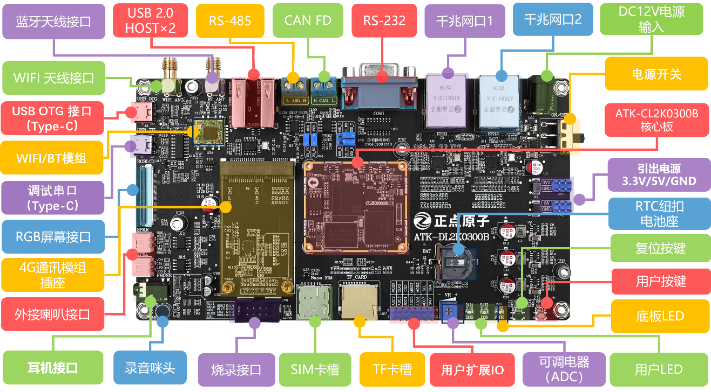
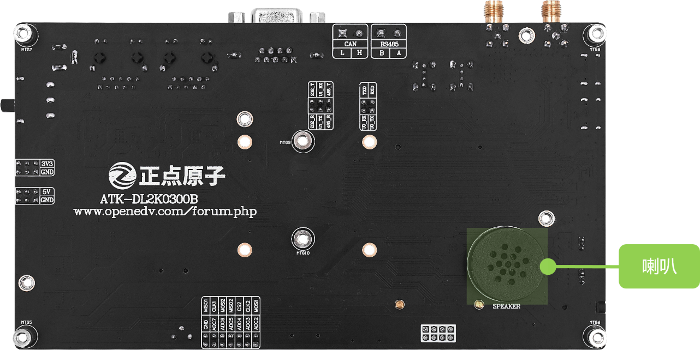
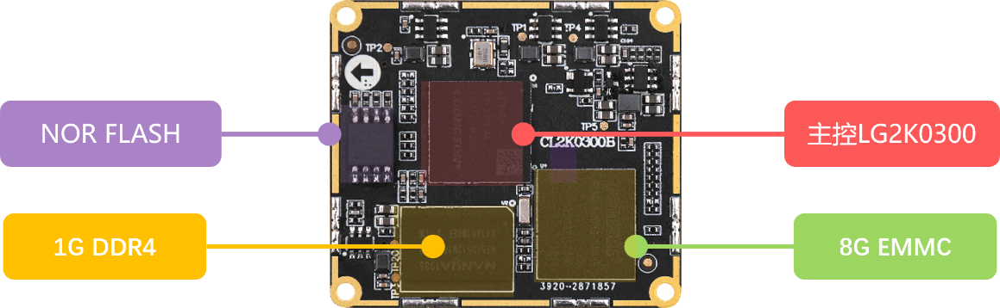
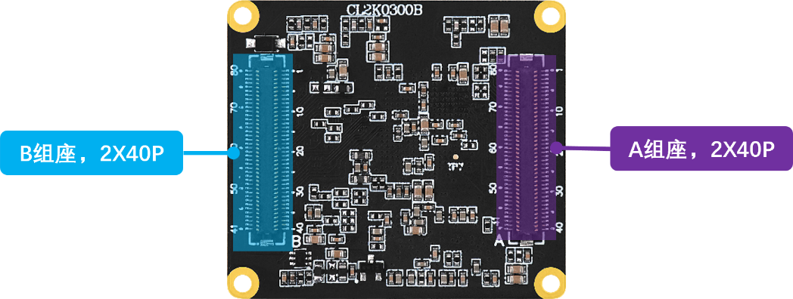

# 1.1 硬件资源简介

## 1.1.1 ATK-DL2K0300B开发板底板资源简介

 
图1.1.1 ATK-DL2K0300B底板资源简介

&emsp;&emsp;更多介绍请参考开发板光盘A-基础资料->10、用户手册->【正点原子】ATK-DL2K0300BB开发板硬件参考手册V1.x.pdf。

## 1.1.2 ATK-DL2K0300B核心板资源

 
图1.2.2BTB核心板资源简介

&emsp;&emsp;要获取更多信息，请查阅开发板光盘A中的以下文档： 02、开发板原理图\01、核心板原理图\ATK-CL2K0300B V1.x.pdf》和03、核心板资料\08、核心板规格书\《【正点原子】ATK-CLMP2K0300B核心板规格书V1.x.pdf》。

