# 2.2 串口软件安装

## 2.2.1 CH340串口驱动安装

&emsp;&emsp;正点原子ATK-DL2K0300B使用了国产芯片CH340来实现USB转串口功能，可以直接通过USB线将板卡的调试串口连接到电脑、而无需使用USB转串口线，方便用户使用；但是需要在Windows下安装CH340驱动才能识别到板卡的调试串口。

&emsp;&emsp;板卡资料包中已经给用户提供了CH340驱动安装文件，路径为：`开发板光盘A盘-基础资料04、辅助软件CH340驱动(USB串口驱动)_XP_WIN7共用SETUP.EXE`，双击SETUP.EXE可执行文件，按照图2.2.1.1~2.2.1.2所示步骤安装CH340驱动：

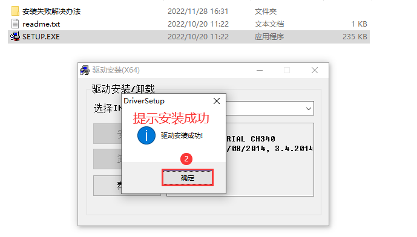 
图2.2.1.2 安装CH340驱动(2)

&emsp;&emsp;安装成功后，通过USB线将板卡调试串口(USB_TTL)与电脑相连，并给开发板上电，连接方式如图2.2.1.3所示：

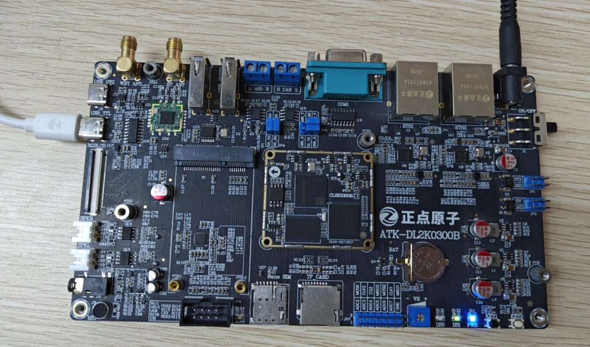 
图2.2.1.3 板卡调试串口与电脑相连

&emsp;&emsp;连接成功后，此时电脑会检测到一个USB设备，打开Windows设备管理器：

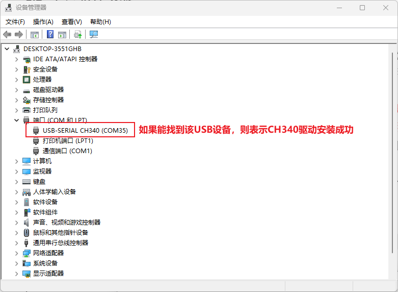 
图2.2.1.4 Windows设备管理器

&emsp;&emsp;如果在“`设备管理器端口（COM和LPT）`”下能找到一个名为“`USB-SERIAL CH340`”的设备，则表示CH340驱动安装成功！如果找不到名为“`USB-SERIAL CH340`”的设备，请用户自行检查硬件连接是否有误！可拔掉USB线、重新连接，或者连接电脑的其它USB口试试。

## 2.2.2 MobaXterm软件安装

&emsp;&emsp;MobaXterm是一款多功能远程终端软件，功能强大、而且免费（也有收费版本），支持创建SSH、Telnet、Rsh、Xdmc、RDP、VNC、FTP、SFTP、串口(Serial COM)等超多远程连接功能。MobaXterm提供了人性化的操作界面，功能十分强大，所以推荐用户使用MobaXterm这款终端软件。

&emsp;&emsp;**1、MobaXterm软件下载**

&emsp;&emsp;板卡资料包中已经给用户提供了MobaXterm软件安装包，路径为：`开发板光盘A盘-基础资料04、辅助软件MobaXterm_Installer_v12.3.zip`；用户也可以通过链接地址：https://mobaxterm.mobatek.net/download.html，自己下载：

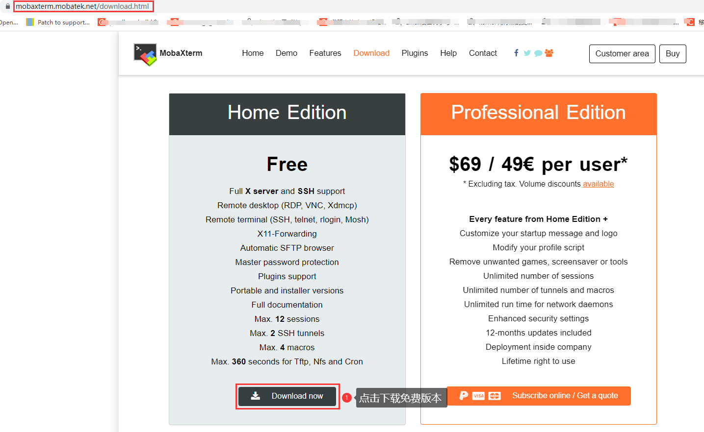 
图2.2.2.1 下载MobaXterm软件(1)

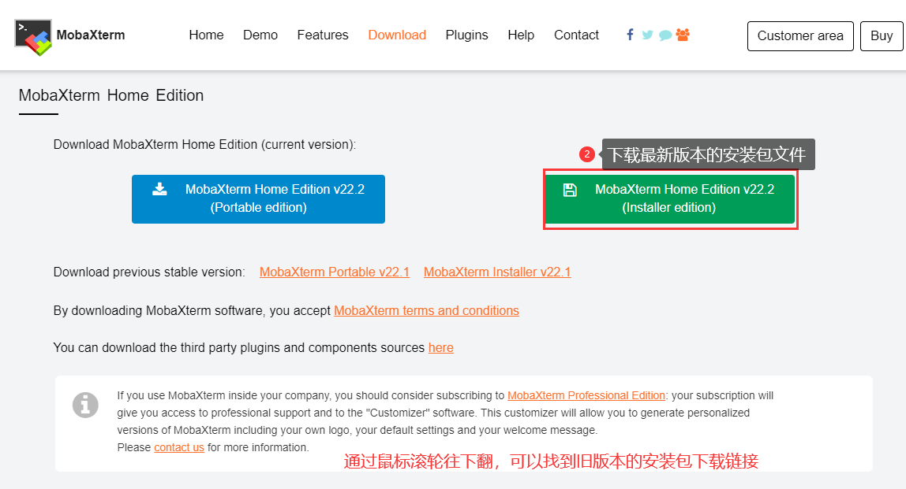 
图2.2.2.2 下载MobaXterm软件(2)

&emsp;&emsp;下载完成后会得到一个名为MobaXterm_Installer_vxxx.zip的压缩包文件（xxx为版本号），目前最新版本为22.2，资料包中给用户提供的安装包对应的版本为12.3，用新的版本也行，旧的版本也可以，这个都没什么关系，这里我们以12.3版本为例。

&emsp;&emsp;**2、MobaXterm软件安装**

&emsp;&emsp;将MobaXterm_Installer_v12.3.zip压缩包文件解压，解压之后如图所示：

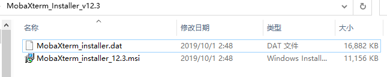 
图2.2.2.3 MobaXterm_Installer_v12.3.zip解压后的文件

&emsp;&emsp;接着双击运行MobaXterm_Installer_v12.3.msi文件，按照图2.2.2.4~2.2.2.8所示步骤安装MobaXterm软件：

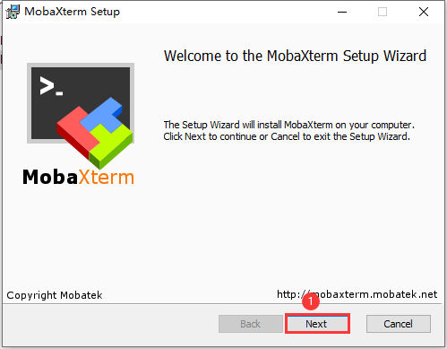 
图2.2.2.4 安装MobaXterm软件(1)

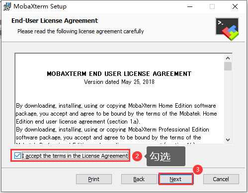 
图2.2.2.5安装MobaXterm软件(2)

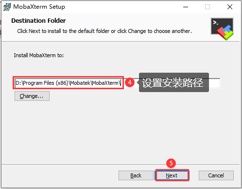 
图2.2.2.6 安装MobaXterm软件(3)

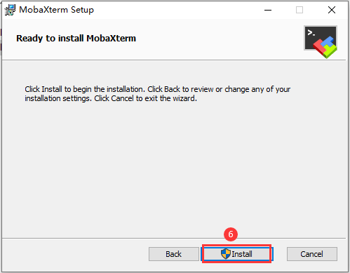 
图2.2.2.7 安装MobaXterm软件(4)

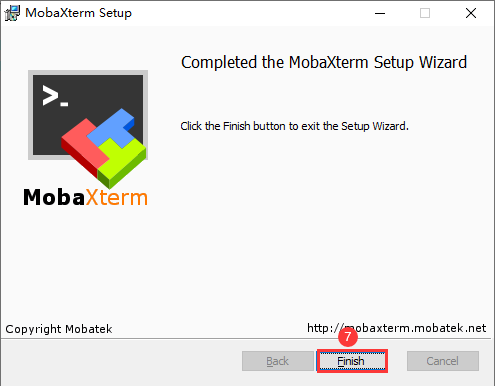 
图2.2.2.8 安装MobaXterm软件(5)

&emsp;&emsp;&emsp;&emsp;至此，软件安装完成，桌面会自动生成MobaXterm软件快捷方式图标：

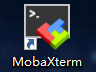 
图2.2.2.9 MobaXterm软件桌面图标

## 2.2.3 MobaXterm软件的串口使用

&emsp;&emsp;双击MobaXterm桌面图标打开该软件，如图2.2.3.1所示：

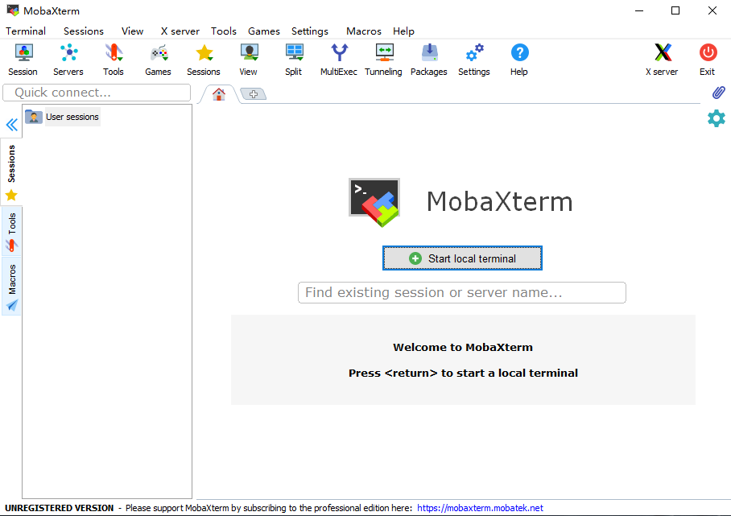 
图2.2.3.1 MobaXterm软件主界面

&emsp;&emsp;接下来向大家介绍如何建立Serial（串口）连接以及ssh远程连接。

&emsp;&emsp;**1. 串口连接**

&emsp;&emsp;串口作为嵌入式设备最为常见的通信接口之一，不但能实现计算机与嵌入式设备之间的数据传输，而且还能实现计算机对嵌入式设备的控制，嵌入式开发过程中，通常将其作为调试接口（串口调试），用于调试嵌入式设备。

&emsp;&emsp;开发过程中我们与ATK-DL2K0300B信息交互，一般是通过串口，当然可以通过网络。网络得先知道ATK-DL2K0300B的ip。所以此时串口十分重要。

&emsp;&emsp;按照图2.2.3.1~2.2.3.4所示操作步骤建立一个Serial（串口）连接（**在建立连接之前，需要通过USB线将ATK-DL2K0300B的调试串口与电脑相连、并且已经安装了CH340驱动**）：

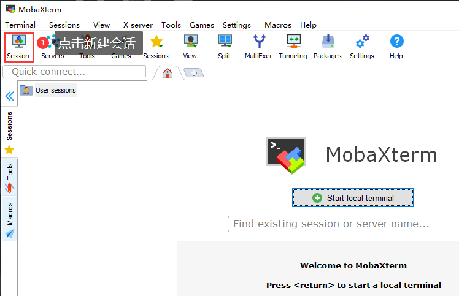 
图2.2.3.1 建立串口连接(1)

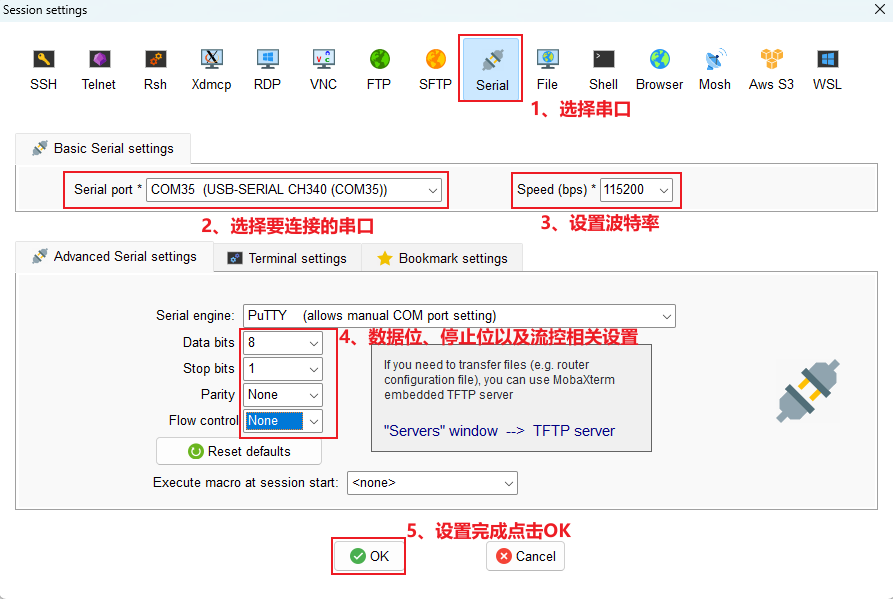 
图2.2.3.2 建立串口连接(2)

&emsp;&emsp;首先选择需要进行连接的串口，确保ATK-DL2K0300B的调试串口与电脑已经通过USB线相连、并且CH340驱动已经安装成功（“`设备管理器端口（COM和LPT`）”下能找到一个名为“USB-SERIAL CH340”的设备），那么MobaXterm软件才能识别到ATK-DL2K0300B的调试串口，我们便可以在“Serial port”下拉列表中找到ATK-DL2K0300B对应的串口（`USB-SERIAL CH340`），然后选择它即可！

&emsp;&emsp;Serial连接就建立成功了，如图2.2.3.3所示：

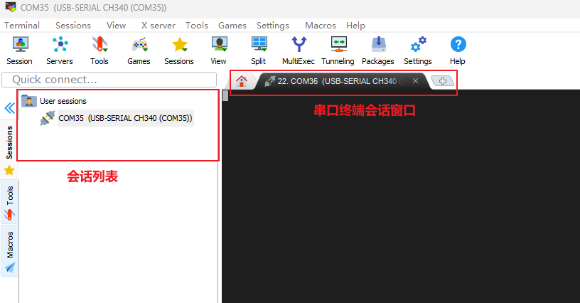 
图2.2.3.3 建立串口连接(3)

&emsp;&emsp;重新打开电源开关上电或者按下开发板上的复位按键，串口输出的信息如图2.2.3.4所示：

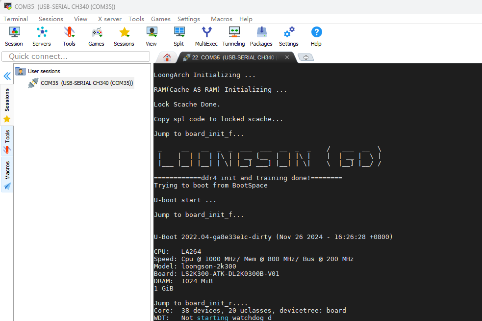 
图2.2.3.4 串口打印日志

&emsp;&emsp;到此为止，如果不需要使用SSH功能，则可以忽略2.2.4章节，直接跳到第三章节去验证开发板的硬件外设功能。

## 2.2.4 MobaXterm软件的SSH使用

&emsp;&emsp;接下来介绍如何建立ssh远程连接，通过ssh可以实现远程登录ATK-DL2K0300B的系统。按照图2.2.4.1~2.2.4.3所示操作步骤建立ssh远程连接、实现远程登录操作：

&emsp;&emsp;**注意：前提是必须先知道开发板的网络IP是多少，否则无法进行下去。此章节可以暂时跳过，到第三章节去验证开发板的硬件外设功能。**

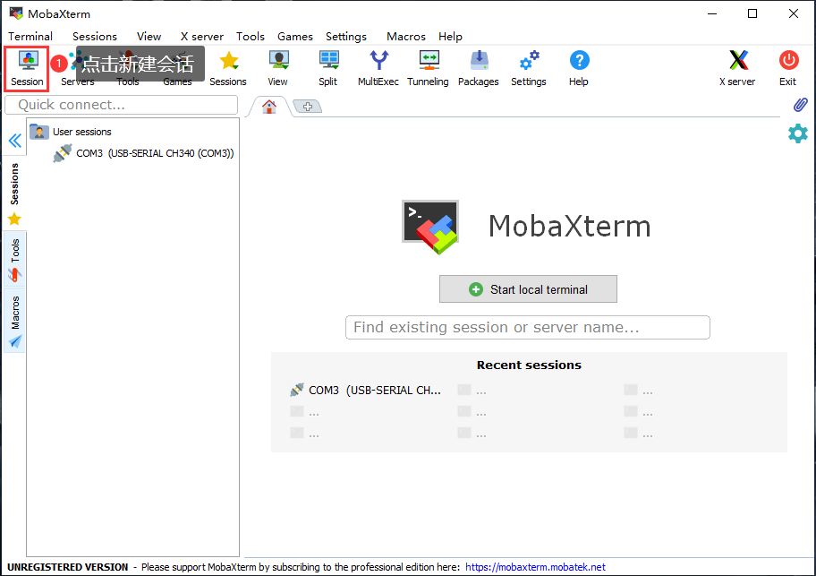 
图2.2.4.1建立ssh远程连接(1)

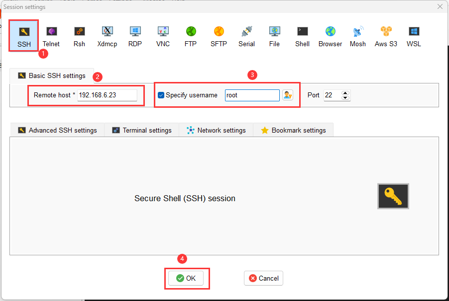 
图2.2.4.2 建立ssh远程连接(2)

&emsp;&emsp;输入密码：root。弹出窗口询问用户是否需要保存密码，我们可以选择“Yes”保存密码、也可以选择“No”不保存，取决于个人。至此，ssh远程连接就创建成功了，如图2.2.4.3所示：

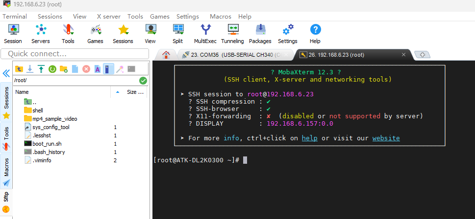 
图2.2.4.3 ssh远程登录成功

&emsp;&emsp;在ssh远程登录的情况下，我们也可通过MobaXterm软件来实现Windows与Ubuntu之间的文件互传（通过sftp协议进行文件传输）。

&emsp;&emsp;**注意：出厂文件系统默认支持SSH服务，当用户使用SSH登录时，需要输入账户为root，密码root。**

