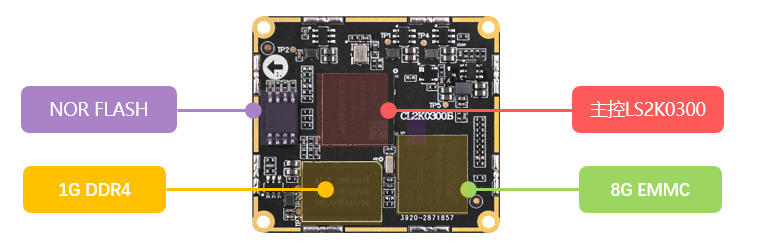
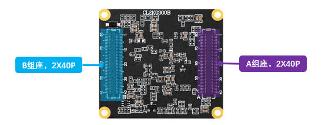
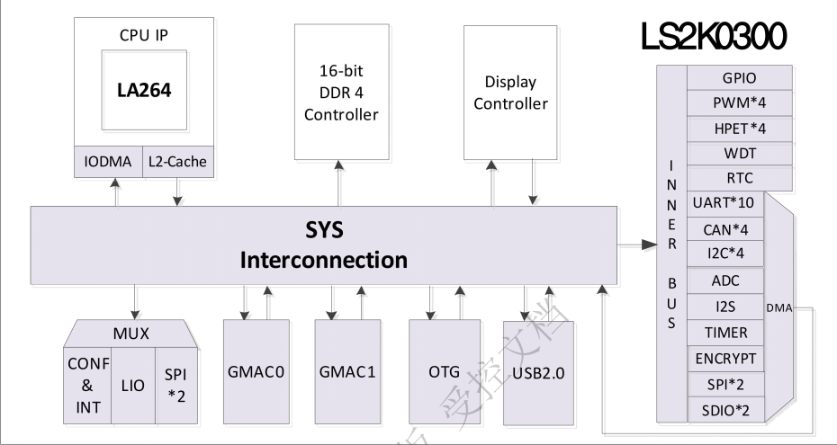

# 2.1 ATK-CL2K0300B核心板硬件参数

| **参数项**     | **参数**                      | **备注**                                                     |
| :------------: | :---------------------------: | :----------------------------------------------------------- |
| 尺寸规格       | 42.00mm*37.00mm               | 长*宽                                                        |
| CPU            | LS 2K0300                     | 塑封 FC-BGA286                                               |
| 内存           | 1GB DDR4                      | 贴片封装。受芯片供货影响，可能会有多种不同厂家的芯片，一切以实际贴片的型号为准。 |
| 存储           | 8G EMMC                       | 贴片封装。受芯片供货影响，可能会有多种不同厂家的芯片，一切以实际贴片的型号为准。 |
| NOR FLASH      | 2MB                           | 贴片封装。受芯片供货影响，可能会有多种不同厂家的芯片，一切以实际贴片的型号为准。 |
| 工作电压       | 5.0V                          |                                                              |
| 功耗（1）      | ≤1.5W                         | 静态功耗，具体功耗取决于外设                                 |
| 工作温度       | 商业级0℃~+70℃                 |                                                              |
| 引脚间距       | 0.5mm                         |                                                              |
| 核心板连接方式 | BTB                           | 连接器：DF12NB(3.0)-80DS-0.5V(51)，母座                      |
| PCB工艺        | 8层，沉金工艺，独立接地信号层 | 采用无铅工艺                                                 |

&emsp;&emsp;注：（1）核心板的功耗数据是由环境12V/1.0A输入，只接串口UART0，不接其他外设。具体功耗数据取决于底板所接的外设。

 
图 2.1.1核心板正面资源(实际版本为主)

 
图 2.1.2核心板引脚说明(实际版本为主)

# 2.2 LS2K0300芯片参数

&emsp;&emsp;LS2K0300主控芯片部分资源汇总表如下：

 
图2.1.2.2.1 芯片资源

&emsp;&emsp;具体细节参数可以参考龙芯官方提供的芯片数据手册。

&emsp;&emsp;**LS2K0300主控芯片资源**

| 处理器     | 64位双发射超标量LA264，支持LoongArch指令系统，典型功耗＜1W，1.0GHz |
| :--------: | :----------------------------------------------------------- |
| 显示接口   | 1 路 DVO 显示输出，分辨率可支持 320×240～1920*1080@60Hz/24bit |
| GMAC控制器 | 两路  10/100/1000Mbps 自适应以太网 MAC，双网卡均兼容 IEEE 802.3 |
| USB控制器  | 1 个独立的 USB2.0 的 HOST 端口 1 个独立的 OTG 端口，支持 HOST/DEVICE模式 |
| I2S        | 1 路 I2S 接口，支持单声道和立体声道音频数据                  |
| SPI        | 2路SPI接口，双缓冲接收器，主模式支持，支持到 4 个的变长字节传输 支持标准读、连续地址读、快速读、双路 I/O 等 SPI Flash 读模式 |
| I2C        | 4路I2C接口，支持低速和快速模式，支持 7 位寻址和 10 位寻址    |
| UART       | 2 个全功能 UART 和流控 TXD,RXD,CTS, RTS, DSR,DTR,DCD, RI 最多 10 个 UART 接口，两路全双工异步数据接收/发送 |
| AD         | 支持 8 路 12 位 AD 电路采样                                  |
| CAN        | 支持 4 路 CAN 接口，支持 CAN-FD                              |
| PWM        | 4 路控制器，32 位计数器，支持脉冲生成及捕获                  |
| SDIO       | 2 路独立 SDIO 控制器 1 路支持 SDIO 系统启动(SDIO0 支持启动，可配置为 eMMC 模式) |
| TIMER      | 3 组定时器 A/G/B-TIMER                                       |
| RTC        | 计时精确到 0.1 秒，可产生 3 个计时中断                       |
| HPET       | 4 个 32 位计数器，支持 1 个周期性中断，支持 2 个非周期性中断v |
| Watchdog   | 32 比特计数器及初始化寄存器，低功耗模式暂停功能              |
| 中断控制器 | 支持软件设置中断，支持电平与边沿触发等                       |
| 温度传感器 | 温度观测，高低温中断                                         |
| GPIO       | 106 位复用 GPIO 引脚，支持外部中断输入                       |

&emsp;&emsp;注意：这里是芯片数据手册资源参数值，非核心板可用资源参数值。

# 2.3 核心板引脚可复用资源

&emsp;&emsp;核心板引出了处理器上的所有IO，用户可以根据自己需要，自行设计底板来运用核心板上IO资源，将IO复用成自己所需要的功能。

&emsp;&emsp;核心板默认出厂固件功能仅支持2.3小节所述，不可直接用于其他复用功能，复用功能固件需额外开发。核心板引脚复用表可参考资料盘上的。

&emsp;&emsp;根据外设功能，此处列举ATK-CL2K0300B核心板可复用的单项外设最大资源数，具体选型可以结合芯片数据手册。以下参考来自2K0300芯片数据手册（单项外设最大资源数：指的是在不使用其他外设的前提下，核心板所能使用的某项外设的最大数量）

| **管脚外设功能** | **单项外设最大复用数** | **备注**                                           |
| :--------------: | :--------------------: | :------------------------------------------------- |
| RGB屏幕接口      | 1                      | 可支持 320×240～1920*1080@60Hz/24bit               |
| PWM              | 4                      | 32 位计数器                                        |
| I2S              | 1                      |                                                    |
| SDIO             | 1                      | 独立 SDIO 控制器                                   |
| Ethernet         | 2                      | 10/100/1000M以太网控制器 （实测750~850M左右） |
| USB 2.0 HOST     | 2                      | 可用USB HUB扩展                                    |
| SPI              | 2                      | 双缓冲接收器，主模式支持                           |
| I2C              | 4                      | 支持7位和10位地址模式                              |
| UART             | 10                     | 2 个全功能 UART                                    |
| CAN              | 4                      | 支持 CANFD                                         |
| ADC              | 8                      | 支持12 bit分辨率                                   |

&emsp;&emsp;*注：ATK-DL2K0300B开发板和ATK-CL2K0300B核心板只支持正点原子官方店铺出售的模块和配件，其他的需用户自行开发或到群里交流学习，目前正点原子能提供的所有资料都在正点原子官方下载中心的网盘里。

