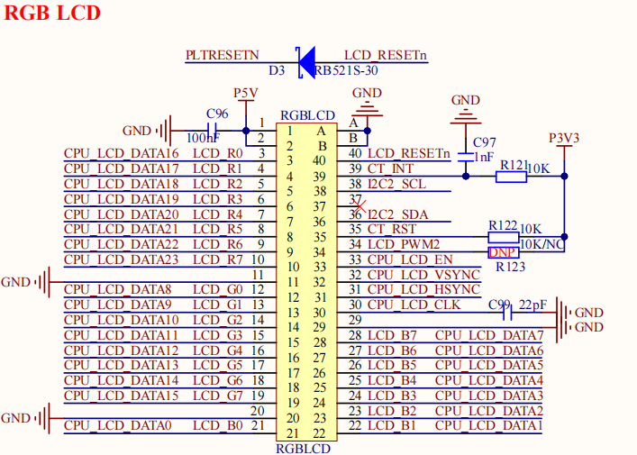

# 2.14 RGB 屏幕接口

&emsp;&emsp;开发板板载一个RGB接口屏幕，原理图如下图所示：

 
图 2.14.1 RGB屏幕接口

&emsp;&emsp;处理器2K0300支持1路DV0接口显示，支持分辨率最大为1920×1080@60Hz。该接口已适配了一款正点原子RGB 7寸1024×600电容触摸屏，支持I2C接口触摸。

&emsp;&emsp;图中CT_INT引脚为屏幕触摸芯片的中断引脚，CT_RST引脚为屏幕触摸芯片的上电复位使能引脚，I2C2_SCL和I2C2_SDA为屏幕触摸芯片的I2C通信接口，用于驱动程序配置触摸芯片，LCD_PWM2引脚为屏幕的背光引脚，支持PWM背光。

