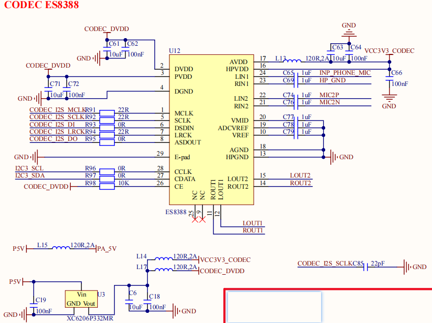
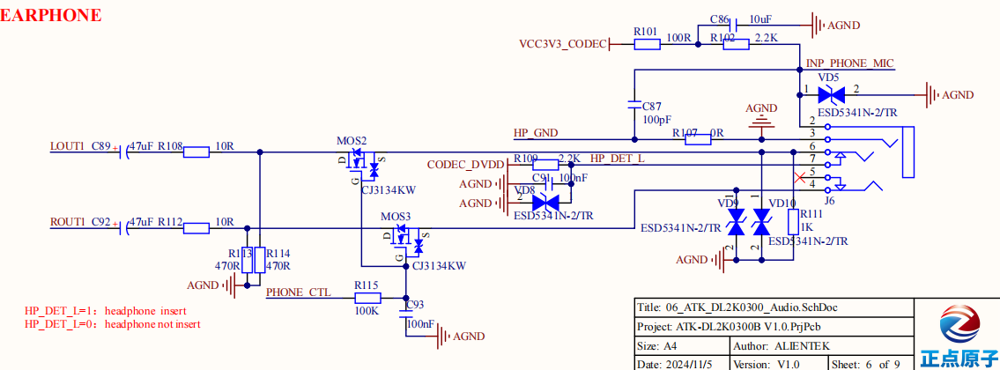
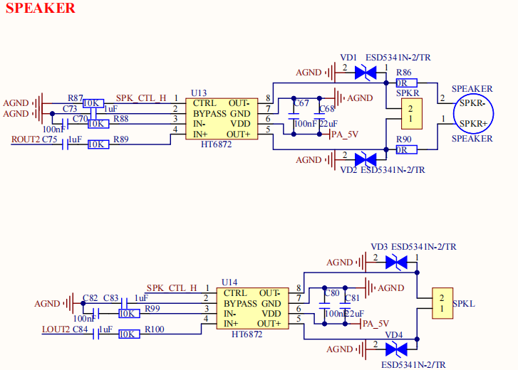
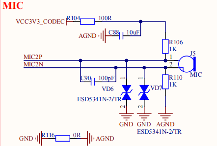

# 2.15 音频接口

&emsp;&emsp;开发板板载ES8388高性能音频编解码芯片，可实现音频放音及录音功能，原理图如下图所示：

 
图 2.15.1 ES8388音频编解码芯片

&emsp;&emsp;顺芯 ES8388 是一款高性能、低功耗、低成本的立体声音频编解码器，该芯片内部集成了24 位高性能 ADC 和 DAC，由双通道 ADC、双通道 DAC、麦克风放大器、耳机放大器、数字音效以及模拟混音和增益功能组成，支持 8KHZ~96KHz 采样率，可通过 I2C 接口进行配置。

 
图 2.15.2耳机放音及录音电路

 
图 2.15.3外置功放扬声器电路

 
图 2.15.4 驻极体麦克风录音电路

&emsp;&emsp;顺芯 ES8388 编解码芯片内部没有功放功能，故需要外置功放芯片才能进行扬声器放音。开发板采用 HT6872 单声道 D 类音频功率放大器，来驱动外部扬声器。

&emsp;&emsp;开发板板载了一个 8Ω1 W 扬声器（在背面），通过功放芯片 HT6872 连接到 ES8388 的 ROUT2 通道，提供给用户进行音频测试，同时还对外提供 SPKR 及 SPKL 两个扬声器连接端子（XH2.54 标准接口），方便用户进行扬声器拓展连接。 

&emsp;&emsp;除了扬声器可以放音，开发板还支持耳机放音。当ES8388播放音频时，在不插入耳机情况下，开发板自动从外置扬声器进行播放；当插入耳机时，会自动 切换到耳机播放，此时扬声器自动停止播放。该设计符合用户常规使用体验。开发板板载耳机 接口 PHONE 采用3.5mm 耳机接口，支持放音、录音及热插拔检测。 

&emsp;&emsp;录音有两种选择，一种是耳机自带的 MIC，一种是开发板板载的驻极体麦克风，同一时刻只能二选一。

