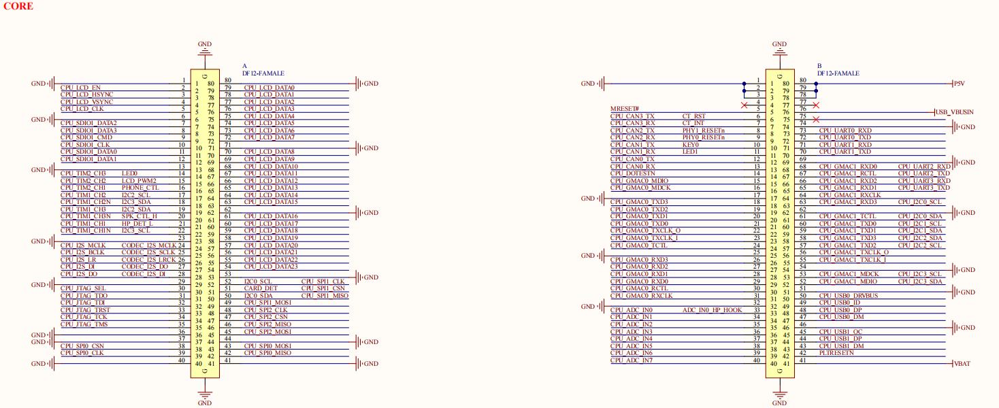
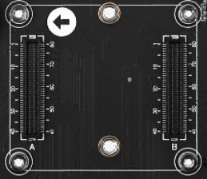

# 2.1 核心板接口

&emsp;&emsp;ATK-DL2K0300B开发板采用核心板+底板的形式，核心板与底板之间由板对板(BTB)方式连接，具有出色的稳定性，并且核心板占用空间小。底板上面的核心板接口定义如下图所示：

 
图 2.1.1 底板对接核心板连接座定义

&emsp;&emsp;图中的A和B就是底板上的连接座接口，由2个2×40PIN的板对板母座组成，共引出160个引脚，其中102个引脚(可复用为普通GPIO其他功能)，58个引脚为电源相关引脚以及功能专属引脚。

 
图 2.1.2 底板转接板接口实物图

&emsp;&emsp;用户在设计底板时，需注意连接座的定义顺序，不要接反了方向。比如，原理图图中 B78~B80引脚是 3 个P5V 电源输入引脚，供电核心板；底板没有做防反插设计，用户在插拔核心板时，需注意底板图中箭头标记方向与核心板的箭头标记方向保持一致，才能对插成功，另外不能太强力拆卸，否则可能会损坏连接座。

