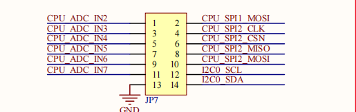

# 2.20 引出IO口

 
图 2.20.1引出IO

&emsp;&emsp;根据底板器件布线方便需要，此处分为两个排针组。用户可以使用这些 IO 连接一些其他模块，进行更多有意思的创新。

&emsp;&emsp;用户在使用这些引出 IO 时，需要检查底板功能电路对这些 IO 的硬件配置情况，比如进行了电阻上下拉、并联电容等，如影响使用，则需要手动移除。在单独使用指定 IO 时，不能和开发板功能有冲突，不能同时使用，需要进行系统复用功能的更改。

