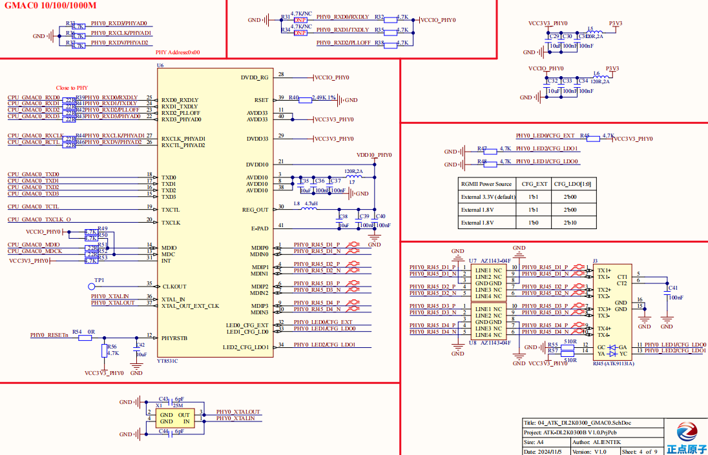

# 2.6 千兆网络接口ETH1

&emsp;&emsp;开发板板载两个千兆以太网接口，ETH1这一路千兆以太网接口原理图如图所示：

 
图 2.6.1 ETH1千兆网络原理图

&emsp;&emsp;2K0300的ETH1需要外接一个支持千兆网络的PHY芯片实现千兆网络联网，图中U6就是一颗10/100/1000M的PHY 芯片，型号为 YT8531C，Pin to Pin 兼容 RTL8211F，因此在我们的开发板上 YT8531C 和 RTL8211F 可以随意互换。

&emsp;&emsp;图J3就是支持千M 网络的RJ45 座，型号为ATK91131A(也可以使用汉仁的HR911131A)，此 RJ45 座内部集成了网络变压器，所以大家在图 3.5.1 中并没有看到网络变压器。

&emsp;&emsp;如果开发板要工作在千 M 模式，对方设备也必须工作在千 M 模式，如果对方设备工作在 10/100M 模式，那么开发板 PHY 芯片会通过自动协商也降低到 10/100M 模式。

