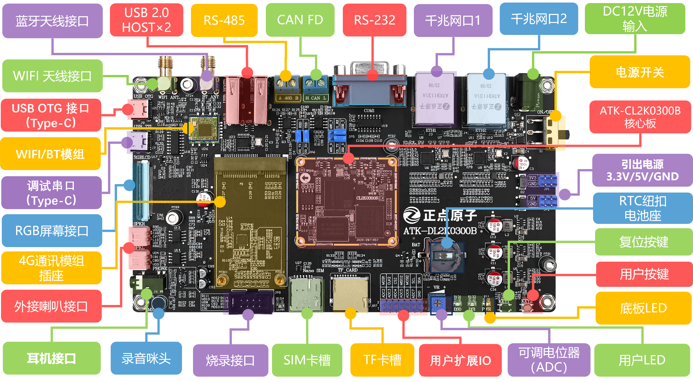
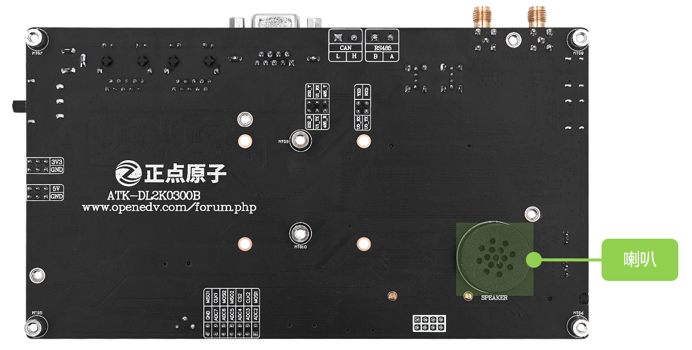

# 7.1 ATK-DL2K0300B开发板

&emsp;&emsp;购买链接：
https://zhengdianyuanzi.tmall.com 

 
图 7.1.1 ATK-DLRK3588B开发板正面

 
图 7.1.2 ATK-DLRK3588B开发板背面

# 7.2 适配模块

&emsp;&emsp;下表配件均可在正点原子店铺上购买https://zhengdianyuanzi.tmall.com

| 4G模块                         | 高新兴ME3630、移远EC20                                  |
| :----------------------------: | :------------------------------------------------------ |
| RGB屏幕(横)                    | 7寸1024×600                                             |
| 底板链接器 (与核心板相连) | 板对板连接器2*40端子母座                                |
| 其他配件                       | USB串口转换器三合一模块(RS232、RS485、TTL)、USBType-C线 |

