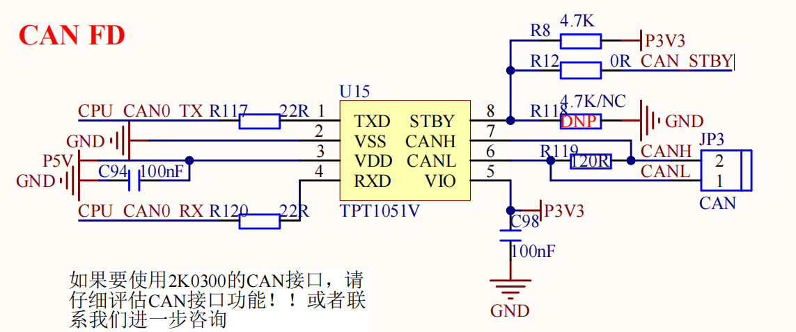

# 2.10 CAN FD接口

&emsp;&emsp;开发板板载1路CAN FD接口电路如图所示：

 
图 2.10.1 CAN FD接口电路

&emsp;&emsp;CAN总线电平也不能直接连接到2K0300对应引脚上，而且CAN 接口支持 CAN FD 模式，这里我们使用 TPT1051V 来做 CAN 电平转换，其中 R119 为终端匹配电阻。

&emsp;&emsp;STBY引脚需要增加GPIO进行使能控制，在CAN FD使用前，可使用GPIO关闭TPT1051V。GPIO默认配置为高电平，正常使用CAN FD功能时，GPIO可以置低。

&emsp;&emsp;注意：GPIO需要选用默认输入功能的引脚，不能使用默认输出低电平状态的GPIO引脚，2K0300中GPIO0~63默认为输入状态。

