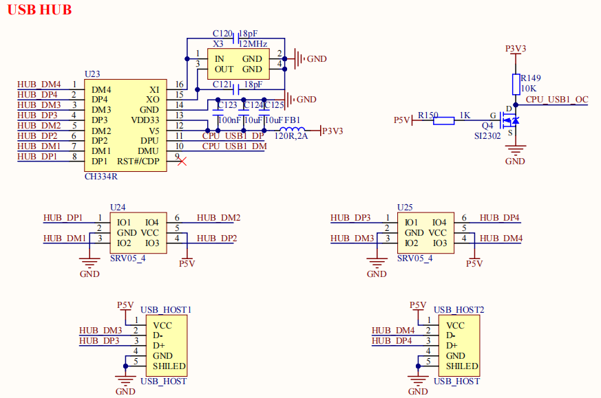

# 2.11 USB2.0 HOST接口

&emsp;&emsp;开发板板载2个USB2.0 HOST接口，原理图如下图所示：

 
图 2.11.1 USB2.0 HOST 电路

&emsp;&emsp;图中有2个USB2.0 HOST接口，通过CH334R芯片将2K0300的USB1扩展为4路USB HOST，其中1路用于连接4G/5G模块，1路用于WIFI/BT模组，另外2路作为USB HOST，用户可以通过这2路USB HOST接口连接USB鼠标、USB键盘、U盘等设备。

