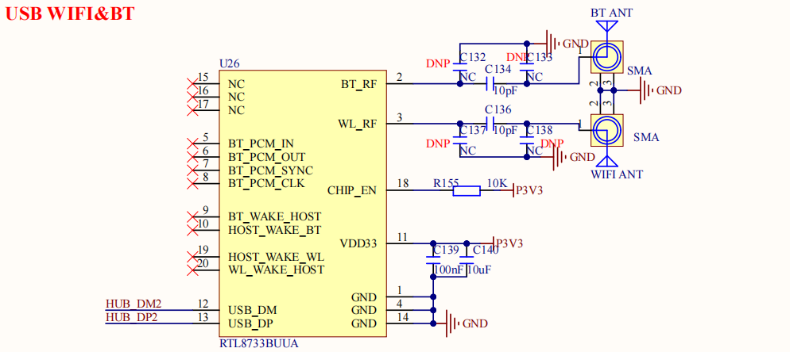

# 2.12 USB WIFI&蓝牙模块

&emsp;&emsp;开发板板载一个USB WIFI&蓝牙模块，原理图如图所示：

 
图 2.12.1 USB WIFI&蓝牙接口

&emsp;&emsp;U26就是就是开发板所使用的 WIFI&蓝牙模块，型号为 RTL8733，这是一个 USB 接口的WIFI&蓝牙模块，支持双频 WIFI。

&emsp;&emsp;连接到了 2K0300 的 USB1 接口上，仅通过一个USB 口即可实现 WIFI 和蓝牙功能。WIFI_ANT 为 WIFI 天线，需要使用支持 5G 的双频 WIFI 天线。BT_ANT 是蓝牙天线接口，一共 2 个天线。

