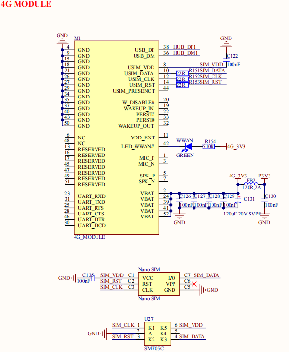

# 2.13 USB 4G模块接口

&emsp;&emsp;开发板板载一个4G Mini PCIE接口，原理图如下图所示：

 
图 2.13.1 USB 4G模块接口

&emsp;&emsp;M1就是 Mini PCIE 接口的 4G 模块连接座，用于连接 Mini PCIE 接口的 4G 模块，比如移远 EC20 模块。Nano SIM 卡座用于插入 Nano SIM 卡，搭配 4G 模块一起使用。

&emsp;&emsp;4G 模块虽然采用 Mini PCIE 接口，但是实际走的 USB 接口，这里是连接到了 CH334R 扩展出来的一个 USB HOST 接口上。

