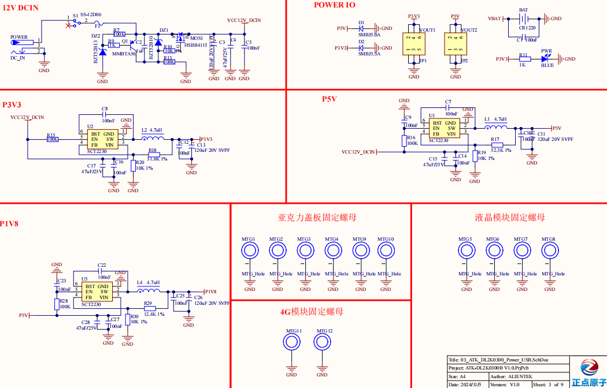

# 2.2 直流电源供电

&emsp;&emsp;开发板板载电源供电部分，原理图如下图所示：

 
图 2.2.1底板供电电路

&emsp;&emsp;开发板所有功能电路需要进行5V、3.3V及1.8V电源供电，S1为开发板的总电源开关。图中共有3个DCDC电源芯片，分别是U1，U2和U5。POWER插座用于外部DC12V电源输入，器件HSBB4115用于高压电路的开关控制保护电路免受高压损坏。

&emsp;&emsp;直流电源经过U1 DCDC芯片转换为5V电源输出，给核心板、音频、RGB LCD、USB和5V输出电路供电。

&emsp;&emsp;同理U2 DCDC芯片转换为3.3V电源输出，给底板、千兆网络等外设提供电路供电。U5 DCDC芯片转换为1.8V电源输出，用于ADC电路功能使用。

