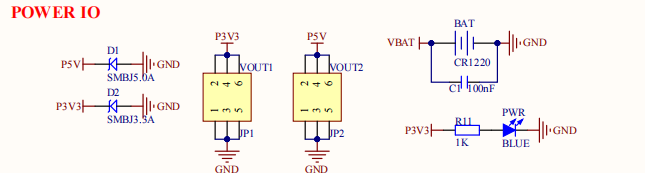

# 2.3 电源输出接口

 
图 2.3.1 电源输出接口

&emsp;&emsp;图中 VOUT1 和 VOUT2 分别是 3.3V 和 5V 的电源输出接口，可以通过开发板给外部提供3.3V 和 5V 电源，方便用户进行扩展使用。

&emsp;&emsp;图中 D1 和 D2 为 TVS 管，可以有效避免 VOUT 外接电源/负载不稳的时候（尤其是开发板外接电机/继电器/电磁阀等感性负载的时候），对开发板造成的损坏。

&emsp;&emsp;同时还能一定程度防止外接电源接反，对开发板造成损坏。

