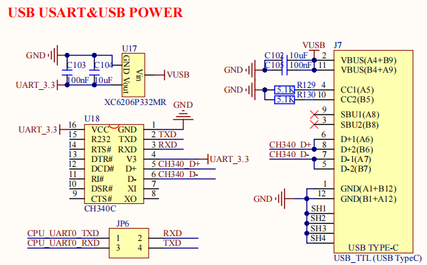

# 2.4 USB-TTL调试串口(系统调试)

&emsp;&emsp;开发板板载一个USB_TTL调试串口，Type-C接口类型，原理图如下所示：

 
图 2.4.1 USB_TTL调试串口

&emsp;&emsp;U18为USB转串口芯片，型号为CH340C，3.3V独立供电。U4是一个LDO芯片，负责给CH340C芯片提供3.3V的电源。CH340C的电源不受开发板的电源开关控制，只要接上USB线CH340C就会上电。

&emsp;&emsp;图中CH340C的RXD/TXD接JP6的RXD/TXD，这个是CH340C芯片的串口接收和发送脚，JP6可以通过跳线帽将CH340C的串口引脚连接到2K0300的uart0上。

&emsp;&emsp;右侧的 J7 是一个 USB Type-C 座，提供 CH343G 和电脑通信的接口，注意，此接口只能做串口功能，不能给开发板供电，开发板必须使用配套的 12V 电源！

