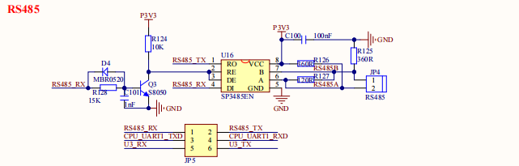

# 2.8 RS485接口

&emsp;&emsp;开发板板载RS485接口电路如图所示：

 
图 2.8.1 RS485接口

&emsp;&emsp;RS485电平不能直接连接到 2K0300，需要电平转换芯片。这里我们使用 SP3485EN 来做485 电平转换，其中 R127 为终端匹配电阻，而 R125 和 R126 则是两个偏置电阻，以保证静默状态时 485 总线维持逻辑 1。

&emsp;&emsp;RS485_RX/RS485_TX 连接在 JP5上面，通过 JP5 跳线来选择是否连接在 2K0300 的 UART1串口上，SP3485EN 的 RE 引脚连接通过一系列的电路连接到了 RS485_RX 引脚上，这样就可 以通过RS485_RX 引脚来控制 RS485 的接收和发送状态，完全将 RS485 当做一个串口来使用。RS232串口

