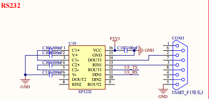

# 2.9 RS232串口

&emsp;&emsp;开发板板载了一个RS232接口，为母头，电路原理图如下图所示：

 
图 2.9.1 RS232串口

&emsp;&emsp;因为 RS232 电平不能直接连接到 2K0300，所以需要一个电平转换芯片。这里我们选择的是 SP3232（也可以用 MAX3232）来做电平转接。

&emsp;&emsp;在使用的时候需要将 JP5跳线帽接起来，U3_RX接 CPU_UART1_TXD，U3_TX 接 CPU_UART1_RXD，所以 RS232 串口使用的是 2K0300 的UART1。

